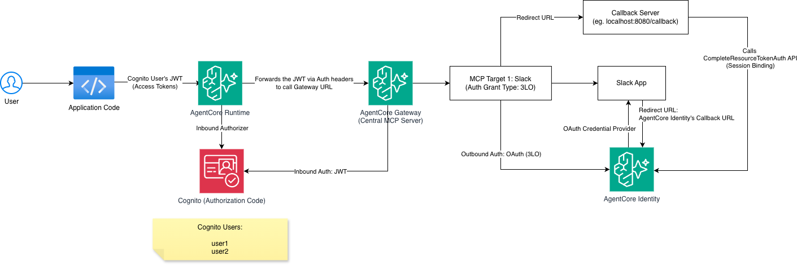
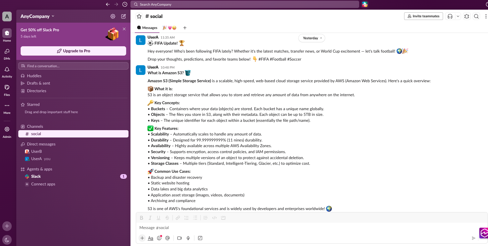
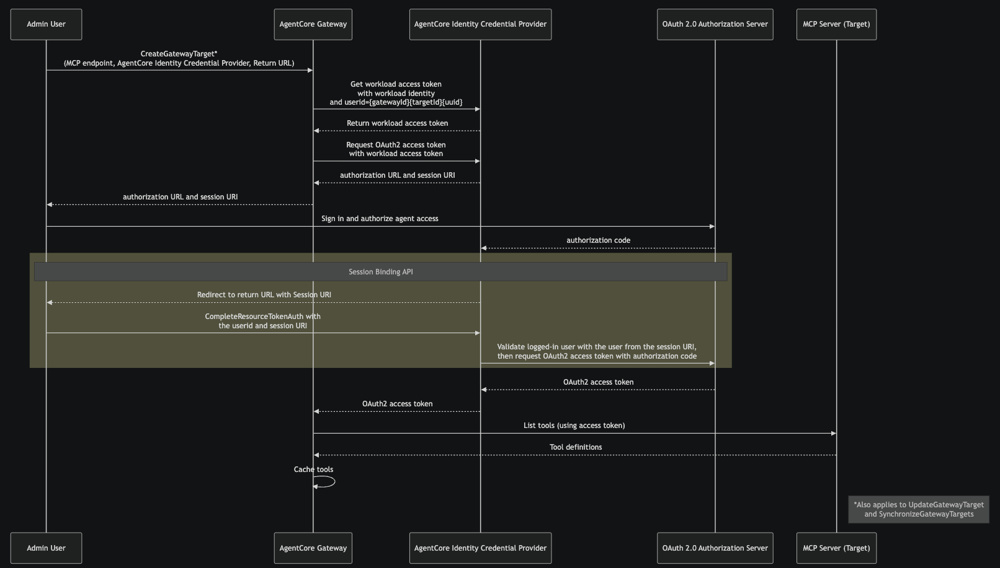

# Slack MCP on AgentCore with 3-Legged OAuth — Tutorial

This tutorial walks you through deploying a sample that runs a Strands agent on
**Amazon Bedrock AgentCore Runtime**, connects it to an **AgentCore Gateway** exposing a
**Slack MCP** integration, and passes the **signed-in user's identity** all the way through
to Slack using **3-legged OAuth (3LO)**.

The payoff: when you ask the agent to post a message, it posts **as you** — the real Slack
user — not as a bot. That is the difference between 3LO (acts as the user) and 2LO (a single
bot token acts as the bot for everyone).

By the end you will have:

- A Cognito user pool (you create sign-in users yourself after deploy, via the AWS console
  or CLI).
- An AgentCore Gateway wired to a Slack MCP target through an AgentCore Identity OAuth2
  provider.
- An AgentCore Runtime hosting the agent, forwarding your Cognito JWT to the gateway.
- A local CLI that signs in as a Cognito user and chats with the agent end to end.

---

## Architecture Diagram



**How it works**
1. **Sign in.** You authenticate against the **Cognito user pool** and receive an access
   token (JWT). Both the runtime and the gateway trust JWTs from this pool because their
   `CUSTOM_JWT` authorizers share the same discovery URL and app client id.
2. **Invoke the runtime.** Your application will send POST requests with your prompt to the runtime with
   `Authorization: Bearer <jwt>`. AgentCore validates the token, then forwards the
   `Authorization` header into the container (`RequestHeaderAllowlist: ["Authorization"]`).
   No credentials live in the runtime code.
3. **Runtime → gateway.** The agent reads that same bearer token and opens an MCP connection
   to the gateway (`GATEWAY_URL`), passing the token along. The gateway's `CUSTOM_JWT`
   authorizer validates it — one token, two hops. Reaching the gateway needs no IAM grant
   because it's an HTTPS call carrying the bearer.
4. **Gateway → Slack (3LO).** For a Slack tool call, the gateway uses the **AgentCore
   Identity** OAuth2 credential provider to run Slack's authorization-code flow with the
   configured `user_scope`. The first time, you complete a browser consent that the callback server binds to your session. AgentCore then holds a **user token** for you, and Slack executes the action **as you**.

## Prerequisites

### 1. Create a Slack app

1. Sign up for a **Slack trial workspace** if you don't have one, then sign in.
2. Go to the Slack API dashboard at <https://api.slack.com/apps/> and click
   **Create New App** → **From scratch**. Give it a name and pick your workspace.
3. Open **Basic Information** → **App Credentials**. Copy the **Client ID** and
   **Client Secret** — you'll paste these into `.env` so the CDK can create the AgentCore
   Identity OAuth2 provider.
4. Open **OAuth & Permissions** → **Scopes** and configure the scopes the sample needs:
   - **Bot Token Scopes**: leave these **unchecked** (as we are using user-based tokens in this example).
   - **User Token Scopes**: check the following —
     - `chat:write`
     - `im:write`
     - `search:read`
     - `users:read`
     - `channels:history`
     - `channels:read`
     - `channels:write`

   > These will match the `user_scope` the gateway target requests during the 3LO flow.
5. Open **Agents** and **enable the Slack MCP server**. This lets your
   app connect to Slack's MCP server to run tools — searching, reading channels, and posting
   messages **on behalf of the signed-in Slack user**.

### 2. Tooling on your machine

- **AWS account + credentials** active in your shell (the deploy uses the account from your
  active credentials; region defaults to `us-east-1`).
- **Node.js 18+** and **npm** (for the CDK app).
- **AWS CDK** bootstrapped in the target account/region (`npx cdk bootstrap` once per
  account/region if you've never used CDK there).
- **Docker with buildx, running** — the runtime agent is built as a `linux/arm64` container
  image and pushed to ECR during `cdk deploy`.
- **Python 3.9+** (for the local CLI).

---

## Deployment

### Step 1 — Configure the CDK `.env`

Duplicate the CDK env template and fill in your values:

```bash
cd slack-gateway-cdk
cp .env.example .env
```

Edit `.env`:

- `SLACK_CLIENT_ID` — your Slack app's **Client ID**.
- `SLACK_CLIENT_SECRET` — your Slack app's **Client Secret**. AgentCore stores this as a
  MANAGED secret in Secrets Manager, and its plaintext can't be read back from the API — so
  you must supply the real value here.

Optional overrides (safe to leave commented):

- `COGNITO_DOMAIN_PREFIX` — the Cognito hosted-UI domain prefix. Must be **globally unique
  across all AWS accounts**; set your own if the default is taken.
- `RESOURCE_SUFFIX` — a fixed, readable suffix (e.g. `dev1`) for the account/region-scoped
  resource names; otherwise a stable hash is derived automatically.
- `BEDROCK_MODEL_ID` — override the agent's model.
- `CDK_DEFAULT_REGION` / `AWS_REGION` — deploy somewhere other than `us-east-1`.

### Step 2 — Deploy the CDK stack

```bash
npm install
npx cdk deploy
```

Make sure **Docker is running** before you deploy — the agent image is built and pushed to
ECR as part of the deploy.

The stack (`SlackGatewayStack`) provisions the following:

| Resource | Type | What it does |
| --- | --- | --- |
| Cognito user pool + resource server + domain + app client | `AWS::Cognito::*` | The trusted JWT issuer for both the gateway and the runtime. App client uses auth-code OAuth + admin-password auth, generates a secret, `invoke` scope. No sign-in users are created — you add them after deploy (Step 3). |
| Slack OAuth2 credential provider | `AWS::BedrockAgentCore::OAuth2CredentialProvider` | AgentCore Identity provider (`SlackOauth2`) built from your Slack client id/secret; drives the 3LO authorization-code flow. |
| Gateway IAM role | `AWS::IAM::Role` | Assumed by the gateway; scoped to fetch workload tokens, the OAuth2 token, and the managed Slack secret. |
| AgentCore Gateway | `AWS::BedrockAgentCore::Gateway` | MCP gateway with a `CUSTOM_JWT` authorizer wired to the Cognito pool/client. |
| Gateway target | `AWS::BedrockAgentCore::GatewayTarget` | Slack integration from an inline OpenAPI schema (`schema/slack-open-api.json`), using the OAuth2 provider with the Slack `user_scope`. |
| Runtime execution role | `AWS::IAM::Role` | Grants the runtime Bedrock model invocation, logs/traces, and ECR pull. |
| Runtime container image | ECR image asset | The Strands agent, built for `linux/arm64` and pushed to the CDK-managed ECR repo. |
| AgentCore Runtime | `AWS::BedrockAgentCore::Runtime` | Hosts the agent (`PUBLIC` network, `CUSTOM_JWT` inbound auth on the same pool/client), forwards the caller's `Authorization` header to the gateway. |

When the deploy finishes, note the stack outputs (`RuntimeArn`, `UserPoolId`,
`UserPoolClientId`, `GatewayUrl`, etc.). The CLI discovers these automatically, so you don't
need to copy them by hand.

### Step 3 — Create a Cognito sign-in user

The stack does not create any sign-in users, so add one from the **AWS console**. Use the
`UserPoolId` from the stack outputs to find the pool.

1. **Create the user.** Go to **Amazon Cognito > User pools > _your pool_ > Users >
   Create user**. Set **User name** to `user1`, choose **Don't send an invitation**, set a
   password (must satisfy the pool policy: 8+ chars with upper, lower, digit, and symbol),
   and create the user. It starts in the **Force change password** state.
2. **Reset the password once for first login.** A console-created user can't sign in until
   its temporary password is changed. In the same pool, open **App integration > App clients
   > _your app client_ > Login pages > View login page** to open the hosted sign-in page.
   Sign in as `user1` with the password from step 1; you'll be prompted to set a **new
   password**. Enter it — this moves the user to **Confirmed**, which is what the CLI's
   admin-password auth needs. (The page then redirects to `http://localhost:8080/callback`;
   a browser error is expected — the password change has already taken effect.)

Use this final username/password in the CLI step below.

### Step 4 — Invoke the runtime from the CLI

The CLI in `cli/` signs in as a Cognito user, invokes the runtime with that user's JWT, and
streams the agent's reply. It also runs a local callback server on port 8080 to complete the
first-time Slack OAuth consent.

```bash
cd ../cli
python -m venv .venv
source .venv/bin/activate
pip install -r requirements.txt

# Username/password for the CLI (defaults to user1). These must match the Cognito
# user you created in Step 3.
cp .env.example .env   # then edit COGNITO_USERNAME / TEST_USER_PASSWORD if needed
```

Start an interactive chat:

```bash
# Signs in as user1 (from .env) and drops into an interactive chat loop.
python invoke_runtime.py

# Or send an opening prompt, then continue chatting:
python invoke_runtime.py "list the slack users"

# Chat as another user you created:
python invoke_runtime.py --user user2

# Override stack name / region if you deployed elsewhere:
python invoke_runtime.py --stack SlackGatewayStack --region us-east-1
```

**First-time Slack consent (3LO binding):** the first Slack tool call needs you to consent
to Slack. The agent's response includes an **authorization URL** — open it in your browser
and approve. Slack redirects to `http://localhost:8080/callback`, where the bundled callback
server (started automatically by `invoke_runtime.py`) binds that consent to your session via
AgentCore Identity. Retry the prompt, and subsequent Slack calls run **as you**.

### Sample prompts to try

Once you're in the interactive chat, here are some prompts that exercise the gateway's Slack
tools:

- `What tools do you have?` — lists the Slack MCP tools the gateway exposes.
- `Send a slack message to the social channel giving a brief description of AWS Lambda.`
- `Send a slack message to user2 giving a brief description of AWS S3.`
- `List the slack users.`
- `Who am I in slack?`

Because every action runs under 3LO, messages appear **from you** (the signed-in user), and
direct messages to another user come from you as the sender.

### Example session

Discovery — ask what the agent can do:

```
you> What tools do you have?
agent> I have access to the following Slack tools:
  - conversationsList — list channels
  - conversationsHistory — read messages in a channel
  - chatPostMessage — post a message to a channel or user
  - searchMessages — search messages
  - usersList / usersInfo — look up users
  ...
```

First-time Slack tool call — authorization required (3LO consent). Before your session is
bound to Slack, the tool call returns an **authorization URL** instead of posting. Open it,
approve, then retry the same prompt:

```
you> Send slack message to social channel on FIFA
agent>   [tool] slack-integration-target___chatPostMessage
agent> Before I can post to Slack as you, I need you to authorize access.
Please open this URL in your browser and approve:

https://slack.com/oauth/v2/authorize?client_id=...&user_scope=chat%3Awrite%2Cim%3Awrite%2C...&redirect_uri=http%3A%2F%2Flocalhost%3A8080%2Fcallback&state=<session_id>

Once you've approved, ask me again and I'll send the message.
```

The callback server (already running on `http://localhost:8080/callback`) receives the Slack
redirect and binds the consent to your session via AgentCore Identity. Re-send the prompt and
the tool now succeeds as you.

Posting to a channel (the agent looks up the channel id first, then posts):

```
you> Send slack message to social channel on Amazon S3
agent> Let me first find the social channel ID, then send the message!
  [tool] slack-integration-target___conversationsList
agent> Found the #social channel (ID: C0BE1T1K8SE). Now sending the FIFA message!
  [tool] slack-integration-target___chatPostMessage
agent> ✅ Message successfully sent to the #social channel! Here's what was posted:

What is Amazon S3?

Amazon S3 (Simple Storage Service) is a scalable, high-speed, web-based cloud storage service provided by AWS (Amazon Web Services). Here's a quick overview:....
```



Direct-messaging another user:

```
you> Send a slack message to user2 giving a brief description of AWS S3
agent>   [tool] slack-integration-target___conversationsOpen
agent>   [tool] slack-integration-target___chatPostMessage
agent> ✅ Sent a DM to user2: "Amazon S3 is an object storage service that offers
industry-leading scalability, data availability, security, and performance..."
you> exit
```

> Tool names are prefixed with the gateway target name (`slack-integration-target___…`), so
> the CLI surfaces them as e.g. `slack-integration-target___chatPostMessage`.


To tear everything down:

```bash
cd ../slack-gateway-cdk
npx cdk destroy
```

---

## Credential Flow

The whole point is a **single Cognito access token** that authenticates two hops, plus a
one-time Slack consent that lets the gateway act as the user.

```
   You (user1)
      │  1. sign in (username/password) → Cognito access token (JWT)
      ▼
   AgentCore Runtime  ──CUSTOM_JWT validates token against the Cognito pool
      │  2. Authorization: Bearer <jwt>  (header allowlisted into the container)
      │     the agent reads the bearer and opens an MCP connection to the gateway
      ▼
   AgentCore Gateway  ──CUSTOM_JWT validates the SAME token (same pool + client)
      │  3. for a Slack tool call, uses the AgentCore Identity OAuth2 provider
      ▼
   AgentCore Identity ──runs Slack's authorization-code (3LO) flow, obtains a USER token
      │  4. one-time browser consent → callback server binds it to your session
      ▼
   Slack  ── executes chat.postMessage / search.users / … AS the signed-in user
```

**AgentCore Gateway 3LO Flow:**


1. AgentCore Gateway requests a workload access token from the AgentCore Identity Credential Provider, passing the AgentCore Gateway workload identity and a user ID in the format {gatewayId}{targetId}{uuid}. This workload access token identifies the AgentCore Gateway as an authorized caller for subsequent credential operations.
2. Using the workload access token, AgentCore Gateway requests an OAuth 2.0 access token from the AgentCore Identity Credential Provider. This provides the admin user with an authorization URL and a session-URI. At this stage, the target is in Needs Authorization status.
3. The admin opens the authorization URL in their browser, signs in, and grants the requested permissions to the AgentCore Gateway.
4. After the admin grants consent, the OAuth 2.0 authorization server sends an authorization code to the AgentCore Identity Credential Provider’s registered callback endpoint.
5. The credential provider redirects the admin browser to the return URL, with the session URI. The admin application calls CompleteResourceTokenAuth, presenting the user id and the session-URI returned in step 2. The credential provider validates that the user who initiated the authorization flow (step 3) is the same user who completed consent. This revents token hijacking if the authorization URL was accidentally shared. If the flow was initiated from the AWS Console, this step is handled automatically. If initiated from another context, the admin is responsible for calling the CompleteResourceTokenAuth API directly.
6. After successful session binding validation, the credential provider exchanges the authorization code with the OAuth 2.0 authorization server for an OAuth 2.0 access token.
7. This access token is used to list the tools on MCP server target; returned tool definitions from the target are cached at AgentCore Gateway.

---

## Repository layout

```
.
├── slack-gateway-cdk/                  # CDK app — the entire AWS deployment
│   ├── bin/app.ts                      # Entrypoint: loads .env, pins region (us-east-1)
│   ├── lib/slack-gateway-stack.ts      # Cognito, OAuth2 provider, gateway, target, runtime, IAM
│   ├── runtime/                        # Strands agent container (forwards the JWT to the gateway)
│   │   ├── runtime_agent.py            # AgentCore entrypoint + MCP client wiring (reads bearer, calls gateway)
│   │   ├── config.py                   # Env-driven config (GATEWAY_URL, model id, MCP version)
│   │   └── Dockerfile                  # linux/arm64 image serving the AgentCore HTTP contract
│   ├── .env.example                    # Slack client id/secret, test password, optional overrides
│   └── README.md                       # Full resource list, naming, and configuration notes
├── cli/                                # Local client for invoking the deployed runtime
│   ├── invoke_runtime.py               # Sign in as a Cognito user, chat with the agent (SSE)
│   ├── callback_server.py              # Localhost:8080 server that completes Slack OAuth consent
│   ├── requirements.txt
│   ├── .env.example                    # COGNITO_USERNAME / TEST_USER_PASSWORD + optional overrides
│   └── README.md                       # CLI details, config resolution, OAuth binding
├── Architecture-Diagram.drawio
└── README.md                           # This tutorial
```

For deeper detail on the deployed resources and configuration options, see
[`slack-gateway-cdk/README.md`](slack-gateway-cdk/README.md). For CLI internals and the OAuth
session-binding flow, see [`cli/README.md`](cli/README.md).

---

## Additional Security Considerations

This repository is intended as a **sample for development environments**. It optimizes for a
quick, self-contained walkthrough — not for production hardening. Before adapting it for a
production deployment, make sure the following are in place:

- **Keep secrets out of CloudFormation templates.** The Slack client secret is injected at
  synth time and gets rendered into the generated template under `cdk.out/` (kept out of
  source control here via `.gitignore`). For production, pass it by reference rather than
  value — e.g. store it in AWS Secrets Manager / SSM Parameter Store and resolve it at deploy
  time with dynamic references or `ClientSecretSource: EXTERNAL` — so plaintext never lands in
  a template, state file, or CI log. 
- **Lock down the runtime's network exposure.** The runtime is deployed with
  `NetworkMode: PUBLIC` (internet-facing, guarded only by the Cognito `CUSTOM_JWT`
  authorizer). For production, restrict inbound access (private networking / VPC, WAF, IP
  allow-lists) and treat the JWT authorizer as one layer of defense, not the only one.
- **Scope Slack permissions to the minimum.** Request only the `user_scope` values your
  use case actually needs, and review them periodically. Broad scopes like
  `channels:write` / `chat:write` let the agent act widely as the user.
- **Rotate credentials and enable revocation.** Rotate the Slack client secret and Cognito
  app-client secret on a schedule, keep token revocation enabled, and shorten token lifetimes
  where practical.
- **Enable auditing and monitoring.** Turn on CloudTrail, and monitor gateway/runtime logs
  and traces so downstream Slack actions taken "as the user" are attributable and auditable.
- **Manage the OAuth callback securely.** The demo binds consent via a localhost callback on
  port 8080. In production, use an HTTPS return URL you control and validate the session
  binding (`CompleteResourceTokenAuth`) to prevent token hijacking if an authorization URL is
  shared.

Review these against your organization's security requirements and the latest AWS guidance
before going to production.

## License
This project is licensed under the MIT-0 License. See the [LICENSE](https://github.com/aws-samples/sample-apj-sup-sa/blob/main/agentic-workloads/agentic-analytics/LICENSE) file.
