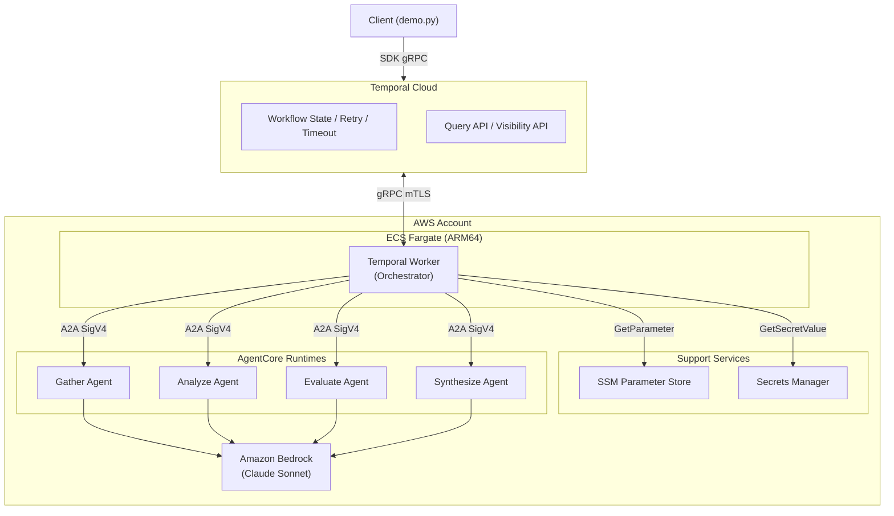
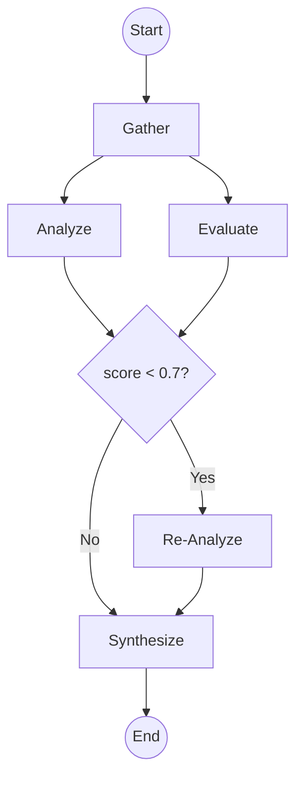

# Declarative Agent Flow (DAF)

> **日本語版は[こちら](docs/README_ja.md)**

A sample architecture for executing multi-agent DAG workflows using independently deployed AgentCore Runtimes, orchestrated by Temporal Cloud.

## Overview

DAF composes multiple AI Agents as a directed acyclic graph (DAG), executing them sequentially or in parallel based on dependency order. Each Agent runs independently on AgentCore Runtime and communicates via the A2A protocol. The Orchestrator is a thin, deterministic runner — it interprets the flow definition and executes the DAG without using an LLM.

## Architecture

<p align="center">



</p>

## DAG Flow

<p align="center">



</p>

- **Gather**: Information retrieval (web search, content extraction)
- **Analyze / Evaluate**: Fan-out — run analysis and quality evaluation in parallel
- **Conditional**: Re-analyze only if the evaluation score is below 0.7
- **Synthesize**: Fan-in — merge analysis and evaluation results into final output

## Key Design Decisions

- **Deterministic orchestration**: The Orchestrator does not use an LLM. Branching, retries, and fan-out/fan-in are handled deterministically
- **Independent scaling**: Each Agent is deployed as a separate AgentCore Runtime and scales independently
- **A2A protocol**: Agents communicate via JSON-RPC 2.0 with SigV4 authentication
- **Temporal-managed reliability**: Retry, idempotency, and timeout logic are delegated to Temporal Cloud — no custom implementation required

## Differentiation

All existing public samples use either "LLM-based dynamic routing" or "all Agents co-located in one container." DAF fills the gap: **deterministic DAG execution × independently scalable Agents**.

| Existing Sample | Approach | DAF Difference |
|---|---|---|
| agentcore-samples (multi-runtimes-with-boto3) | LLM decides routing (Supervisor) | Deterministic DAG, no LLM |
| temporal-community/amazon-bedrock-temporal-samples | All Agents in one container | Each Agent scales independently |
| sample-strands-agent-with-agentcore | A2A but LLM-dependent routing | Declarative flow definition |

## Use Cases

- Research pipelines (gather → analyze → evaluate → synthesize)
- Document processing (extract → classify → summarize → review)
- Code generation workflows (requirements → implement → test → review)
- Data quality checks (validate → detect anomalies → suggest fixes)

## Cost

- Temporal variant: ~$150/month + Bedrock usage
- YAML variant (lightweight PoC): ~$30/month + Bedrock usage

## Prerequisites for Deployment

Before deploying, update the following files with your own values:

| File | Field | Description |
|---|---|---|
| `cdk/cdk.json` | `context.region` | Your AWS region (e.g. `us-west-2`) |
| `cdk/cdk.json` | `context.temporal_address` | Your Temporal Cloud gRPC endpoint |
| `cdk/cdk.json` | `context.temporal_namespace` | Your Temporal Cloud namespace |
| Environment variable | `TEMPORAL_API_KEY` | Temporal Cloud API key (store in Secrets Manager for production) |

## Quick Start

```bash
# Start Agents locally
cd agents && source .venv/bin/activate
PORT=9001 python -m gather.main &
PORT=9002 python -m analyze.main &
PORT=9003 python -m evaluate.main &
PORT=9004 python -m synthesize.main &

# Start Worker
cd workflow && source .venv/bin/activate
export TEMPORAL_ADDRESS="<namespace>.tmprl.cloud:7233"
export TEMPORAL_NAMESPACE="<namespace>"
export TEMPORAL_API_KEY="<your-api-key>"
export AGENT_ENDPOINTS='{"gather":"http://localhost:9001","analyze":"http://localhost:9002","evaluate":"http://localhost:9003","synthesize":"http://localhost:9004"}'
python main.py

# Run demo
python demo.py "Investigate multi-agent design patterns for generative AI"
```

## Repository Structure

```
workflow/                       — Temporal Worker (Orchestrator)
  main.py                      — Worker entrypoint
  demo.py                      — Demo CLI with progress display
  flows/                       — Workflow definitions (DAG flows)
    research_pipeline.py       — Research pipeline DAG
  activities.py                — Activity definitions (Agent invocation)
  a2a_client.py                — A2A communication layer (local/AWS)

agents/                        — Individual Agents (AgentCore Runtime)
  gather/main.py
  analyze/main.py
  evaluate/main.py
  synthesize/main.py

cdk/                           — CDK infrastructure
  stacks/

docs/                          — Documentation
  variant-a-temporal.md        — Temporal variant: architecture + code
  variant-b-yaml.md            — YAML variant: architecture + code
  specs-temporal.md            — Temporal variant: deploy, IAM, networking
  specs-yaml.md                — YAML variant: deploy, IAM, networking
  code-walkthrough.md          — Code walkthrough
```

## Documentation

- [Temporal Variant](docs/variant-a-temporal.md) — Production-ready with Temporal Cloud
- [YAML Variant](docs/variant-b-yaml.md) — Lightweight, no external dependencies
- [Code Walkthrough](docs/code-walkthrough.md) — Detailed code explanation

## License

MIT
