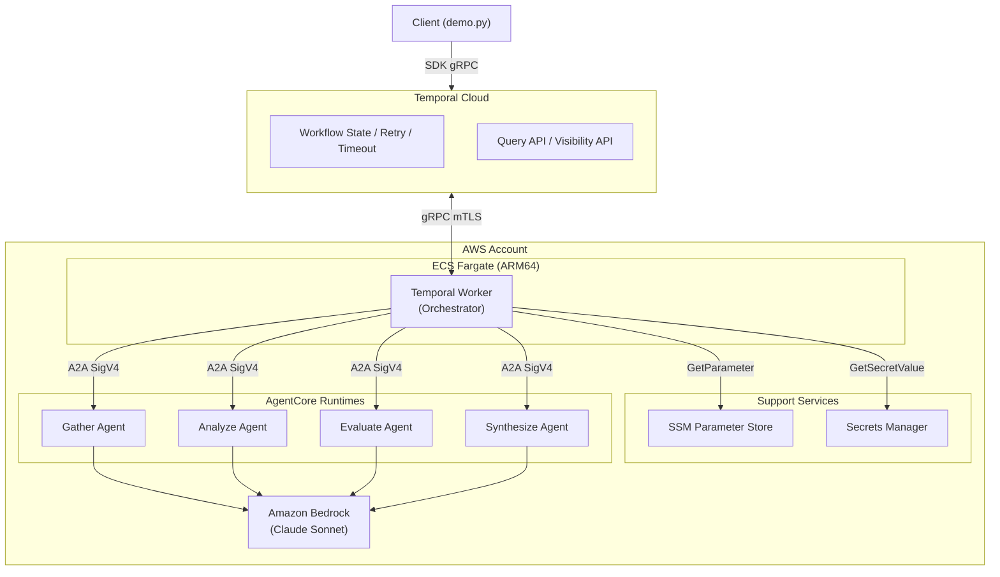
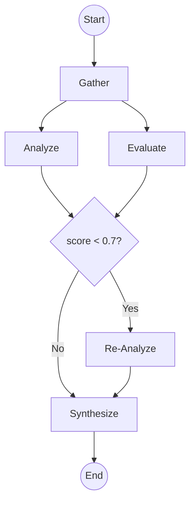

# Declarative Agent Flow (DAF)

> **English version is [here](../README.md)**

独立デプロイされた AgentCore Runtime を Temporal Cloud でオーケストレーションする、マルチエージェント DAG ワークフローのサンプルアーキテクチャです。

## 概要

複数の AI Agent を非巡回グラフ（DAG）として構成し、依存関係に従って順次・並列に実行します。各 Agent は AgentCore Runtime 上で独立稼働し、A2A プロトコルで通信します。Orchestrator は LLM を使用しない決定的な DAG ランナーです。

## アーキテクチャ

<p align="center">



</p>

## DAG フロー

<p align="center">



</p>

- **Gather**: 情報収集（Web検索、コンテンツ抽出）
- **Analyze / Evaluate**: fan-out で並列実行。分析と品質評価を同時に行う
- **条件分岐**: evaluate のスコアが 0.7 未満の場合のみ Re-Analyze を実行
- **Synthesize**: fan-in。分析結果と評価結果を統合して最終出力を生成

## 設計方針

- **決定的オーケストレーション**: Orchestrator は LLM を使わない。分岐・リトライ・fan-out/fan-in は全て決定的に処理
- **独立スケール**: 各 Agent は個別の AgentCore Runtime としてデプロイされ、独立にスケール
- **A2A プロトコル**: JSON-RPC 2.0 + SigV4 認証で Agent 間通信
- **Temporal による信頼性**: リトライ・冪等性・タイムアウトは Temporal Cloud に委譲。自前実装不要

## 既存サンプルとの差別化

既存の公開サンプルは全て「LLM が動的にルーティング」か「全 Agent が1コンテナに同居」する構成です。DAF は **決定的 DAG 実行 × 独立スケール Agent** のパターンを埋めます。

| 既存サンプル | アプローチ | DAF との違い |
|---|---|---|
| agentcore-samples (multi-runtimes-with-boto3) | LLM がルーティング判断 (Supervisor型) | 決定的 DAG 実行、LLM 不使用 |
| temporal-community/amazon-bedrock-temporal-samples | Agent が1コンテナに同居 | 各 Agent が独立スケール |
| sample-strands-agent-with-agentcore | A2A 使用だが LLM 依存の動的ルーティング | 宣言的フロー定義 |

## ユースケース

- リサーチパイプライン（情報収集 → 分析 → 評価 → 統合）
- ドキュメント処理（抽出 → 分類 → 要約 → レビュー）
- コード生成ワークフロー（要件分析 → 実装 → テスト → レビュー）
- データ品質チェック（バリデーション → 異常検知 → 修正提案）

## コスト

- Temporal版: 約 $150/月 + Bedrock 従量課金
- YAML版（PoC向け軽量版）: 約 $30/月 + Bedrock 従量課金

## デプロイ前の設定

デプロイ時は以下のファイルを自身の環境に合わせて更新してください:

| ファイル | フィールド | 説明 |
|---|---|---|
| `cdk/cdk.json` | `context.region` | AWS リージョン（例: `us-west-2`） |
| `cdk/cdk.json` | `context.temporal_address` | Temporal Cloud の gRPC エンドポイント |
| `cdk/cdk.json` | `context.temporal_namespace` | Temporal Cloud の namespace |
| 環境変数 | `TEMPORAL_API_KEY` | Temporal Cloud API キー（本番では Secrets Manager に格納） |

## クイックスタート

```bash
# Agent 起動
cd agents && source .venv/bin/activate
PORT=9001 python -m gather.main &
PORT=9002 python -m analyze.main &
PORT=9003 python -m evaluate.main &
PORT=9004 python -m synthesize.main &

# Worker 起動
cd workflow && source .venv/bin/activate
export TEMPORAL_ADDRESS="<namespace>.tmprl.cloud:7233"
export TEMPORAL_NAMESPACE="<namespace>"
export TEMPORAL_API_KEY="<your-api-key>"
export AGENT_ENDPOINTS='{"gather":"http://localhost:9001","analyze":"http://localhost:9002","evaluate":"http://localhost:9003","synthesize":"http://localhost:9004"}'
python main.py

# デモ実行
python demo.py "生成AIエージェントのマルチエージェント設計パターンを調査してください"
```

## リポジトリ構成

```
workflow/                       — Temporal Worker (Orchestrator)
  main.py                      — Worker 起動
  demo.py                      — デモ CLI（進捗表示付き）
  flows/                       — Workflow 定義（DAG フロー）
    research_pipeline.py       — リサーチパイプライン DAG
  activities.py                — Activity 定義（Agent 呼び出し）
  a2a_client.py                — A2A 通信層（ローカル/AWS 両対応）

agents/                        — 各 Agent（AgentCore Runtime 上で独立稼働）
  gather/main.py
  analyze/main.py
  evaluate/main.py
  synthesize/main.py

cdk/                           — CDK インフラ定義
  stacks/

docs/                          — ドキュメント
  variant-a-temporal.md        — Temporal版: アーキテクチャ + 実装コード
  variant-b-yaml.md            — YAML版: アーキテクチャ + 実装コード
  specs-temporal.md            — Temporal版: デプロイ、IAM、NW
  specs-yaml.md                — YAML版: デプロイ、IAM、NW
  code-walkthrough.md          — コード解説
```

## ドキュメント

- [Temporal版](variant-a-temporal.md) — 本番向け構成
- [YAML版](variant-b-yaml.md) — 検証・PoC向け構成
- [コード解説](code-walkthrough.md) — 実装の詳細

## License

MIT
