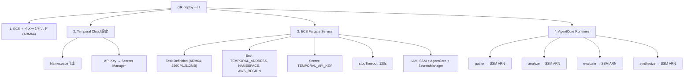

# Variant A: Temporal版 — インフラ仕様

## リポジトリ構成

```
workflow/
├── Dockerfile
├── main.py                 # Temporal Worker起動
├── demo.py                 # デモCLI（進捗表示付き）
├── activities.py           # invoke_agent Activity
├── a2a_client.py           # A2Aクライアント（ローカル/AWS両対応）
└── flows/
    └── research_pipeline.py

agents/
├── Dockerfile              # 共通Dockerfile (ARG AGENT_NAME)
├── gather/
│   └── main.py
├── analyze/
│   └── main.py
├── evaluate/
│   └── main.py
└── synthesize/
    └── main.py

cdk/
├── cdk.json
├── app.py
└── stacks/
    ├── network_stack.py        # VPC
    ├── agents_stack.py         # ECR + SSM + Agent IAM Role
    └── orchestrator_stack.py   # ECS Fargate (ARM64) + IAM
```

## デプロイフロー



## IAMポリシー

### Orchestrator (ECS Task Role)

```json
{
  "Statement": [
    {
      "Effect": "Allow",
      "Action": "ssm:GetParameter",
      "Resource": "arn:aws:ssm:<REGION>:<ACCOUNT>:parameter/agents/*"
    },
    {
      "Effect": "Allow",
      "Action": "bedrock-agentcore:InvokeAgentRuntime",
      "Resource": "arn:aws:bedrock-agentcore:<REGION>:<ACCOUNT>:runtime/*"
    },
    {
      "Effect": "Allow",
      "Action": "secretsmanager:GetSecretValue",
      "Resource": "arn:aws:secretsmanager:<REGION>:<ACCOUNT>:secret:daf/temporal-*"
    }
  ]
}
```

### Worker Agent (AgentCore Execution Role)

```json
{
  "Statement": [
    {
      "Effect": "Allow",
      "Action": ["bedrock:InvokeModel", "bedrock:InvokeModelWithResponseStream"],
      "Resource": [
        "arn:aws:bedrock:*::foundation-model/*",
        "arn:aws:bedrock:<REGION>:<ACCOUNT>:inference-profile/*",
        "arn:aws:bedrock:*:*:inference-profile/*"
      ]
    },
    {
      "Effect": "Allow",
      "Action": "ecr:GetAuthorizationToken",
      "Resource": "*"
    },
    {
      "Effect": "Allow",
      "Action": ["ecr:BatchGetImage", "ecr:GetDownloadUrlForLayer", "ecr:BatchCheckLayerAvailability"],
      "Resource": "arn:aws:ecr:<REGION>:<ACCOUNT>:repository/daf-agent-*"
    }
  ]
}
```

## ネットワーク

| 通信 | 経路 | プロトコル |
|---|---|---|
| ECS → Temporal Cloud | アウトバウンド | gRPC (port 7233) mTLS |
| ECS → AgentCore | アウトバウンド | HTTPS (bedrock-agentcore endpoint) |
| ECS → SSM / SecretsManager | アウトバウンド | HTTPS (AWS API) |
| AgentCore → Bedrock | AWSマネージド | 内部 |
| Client → Temporal Cloud | 直接 | SDK (gRPC) or UI (HTTPS) |

- ECS Fargateはインバウンドポート不要（Temporal Workerはpoll型）
- Security Groupはアウトバウンドのみ開放
- VPCリソース（RDS等）へのアクセスが必要な場合のみVPC設定を追加

## スケーリング

| コンポーネント | 方式 | 上限 |
|---|---|---|
| Orchestrator (ECS) | ECS Auto Scaling (Temporal backlogメトリクス) | ECS Service上限 |
| Worker Agent | AgentCore自動スケール | 1000 VM/アカウント (us-east-1, us-west-2) |
| Temporal Cloud | マネージド | プランに応じた Actions/月 |
| Bedrock | マネージド | モデル別クォータ |

## ECS固有設定

| 項目 | 値 | 理由 |
|---|---|---|
| CPU Architecture | ARM64 | コスト最適化 |
| stopTimeout | 120s | グレースフルシャットダウン確保 |
| WorkerStopTimeout (SDK) | 90s | stopTimeoutより短く |
| Fargate Spot | 利用可 (weight=1, base=1) | 失敗ActivityはTemporalが再スケジュール |
| CPU / Memory | 0.25 vCPU / 0.5 GB | デモ構成。ワークロードに応じて調整 |

## コスト目安

| コンポーネント | 月額 |
|---|---|
| Temporal Cloud (Essentials) | ~$100 |
| ECS Fargate (0.25 vCPU, 常時1台) | ~$10 |
| AgentCore Runtime | 従量課金 |
| Bedrock | トークン従量 |
| Langfuse (Self-hosted) | 無料 |
| SSM Parameter Store | 無料 (Standard tier) |
| Secrets Manager | ~$0.40/secret/月 |
