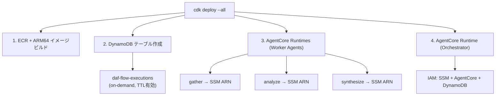

# Variant B: YAML版 — インフラ仕様

## リポジトリ構成

```
orchestrator/
├── Dockerfile
├── main.py                 # BedrockAgentCoreApp entrypoint
├── engine.py               # FlowEngine (DAG実行)
├── dag.py                  # トポロジカルソート
├── resolver.py             # JSONPath解決、condition評価
├── retry.py                # リトライロジック
├── a2a_client.py           # A2Aクライアント
├── status_store.py         # DynamoDB書き込み
└── flows/
    └── research-pipeline.yaml

agents/
├── gather/
│   ├── Dockerfile
│   └── main.py
├── analyze/
│   ├── Dockerfile
│   └── main.py
├── evaluate/
│   ├── Dockerfile
│   └── main.py
└── synthesize/
    ├── Dockerfile
    └── main.py

infrastructure/
└── cdk/
    ├── app.py
    └── stacks/
        ├── orchestrator_stack.py   # AgentCore Runtime + DynamoDB
        └── agents_stack.py         # AgentCore Runtimes + SSM
```

## デプロイフロー



## IAMポリシー

### Orchestrator (AgentCore Execution Role)

```json
{
  "Statement": [
    {
      "Effect": "Allow",
      "Action": "ssm:GetParameter",
      "Resource": "arn:aws:ssm:*:*:parameter/agents/*"
    },
    {
      "Effect": "Allow",
      "Action": "bedrock-agentcore:InvokeAgentRuntime",
      "Resource": "arn:aws:bedrock-agentcore:*:*:runtime/*"
    },
    {
      "Effect": "Allow",
      "Action": ["dynamodb:PutItem", "dynamodb:UpdateItem", "dynamodb:GetItem", "dynamodb:Query"],
      "Resource": "arn:aws:dynamodb:*:*:table/daf-flow-executions"
    }
  ]
}
```

### Worker Agent (AgentCore Execution Role)

```json
{
  "Statement": [
    {
      "Effect": "Allow",
      "Action": "bedrock:InvokeModel",
      "Resource": "arn:aws:bedrock:*::foundation-model/*"
    }
  ]
}
```

## ネットワーク

| 通信 | 経路 | プロトコル |
|---|---|---|
| Orchestrator → AgentCore (Worker) | AWSマネージドエンドポイント | HTTPS |
| AgentCore → Bedrock | AWSマネージド | 内部 |
| Orchestrator → DynamoDB | AWSマネージドエンドポイント | HTTPS |
| Client → Orchestrator | AgentCoreエンドポイント | HTTPS / WebSocket |

- VPC設定は不要（全てパブリックエンドポイント経由）
- Worker AgentがVPCリソース（RDS等）にアクセスする場合のみVPC接続設定を追加

```
Client → https://bedrock-agentcore.{region}.amazonaws.com/runtimes/{arn}/invocations/
       → AgentCoreサービスがリクエストをOrchestratorコンテナにルーティング
```

## スケーリング

| コンポーネント | 方式 | 上限 |
|---|---|---|
| Orchestrator | AgentCore自動スケール | 1000 VM/アカウント (us-east-1, us-west-2) |
| Worker Agent | AgentCore自動スケール（独立） | 同上（Runtimeごとに独立） |
| DynamoDB | on-demand (自動) | アカウント上限に準拠 |
| Bedrock | マネージド | モデル別クォータ |

## DynamoDBテーブル設計

```
Table: daf-flow-executions
Billing: PAY_PER_REQUEST (on-demand)
TTL: ttl attribute (30日で自動削除)

PK: flow#{flow_execution_id}  (String)
SK: META | step#{step_id}     (String)
```

### レコード例

| PK | SK | status | その他 |
|---|---|---|---|
| flow#abc123 | META | running | flow_name, started_at, ttl |
| flow#abc123 | step#gather | completed | output, started_at, completed_at |
| flow#abc123 | step#analyze | running | started_at, attempt |
| flow#abc123 | step#evaluate | completed | output, completed_at |
| flow#abc123 | step#synthesize | pending | — |

### アクセスパターン

| 操作 | キー条件 |
|---|---|
| フロー全体のステータス取得 | `Query PK=flow#abc123` |
| 特定ステップの取得 | `GetItem PK=flow#abc123, SK=step#gather` |
| フロー一覧（直近） | GSI (status-index) or Scan with filter |

## AgentCore固有設定

| 項目 | 値 | 理由 |
|---|---|---|
| /ping応答 | `add_async_task` で HealthyBusy を維持 | アイドル15分タイムアウト回避 |
| セッション最大時間 | 8時間 | フローのtimeout_sec上限 |
| ポート | 9000 | AgentCore標準 (非公式にはport 8080も可) |
| プラットフォーム | AL2023 ARM64 | AgentCore要件 |

## コスト目安

| コンポーネント | 月額 |
|---|---|
| AgentCore Runtime (Orchestrator) | 従量課金 |
| AgentCore Runtime (Worker Agents) | 従量課金 |
| DynamoDB (on-demand) | ~$0 (低トラフィック時) |
| Bedrock | トークン従量 |
| Langfuse (Self-hosted) | 無料 |
| SSM Parameter Store | 無料 (Standard tier) |
| ECR | ~$0.10/GB/月 |
