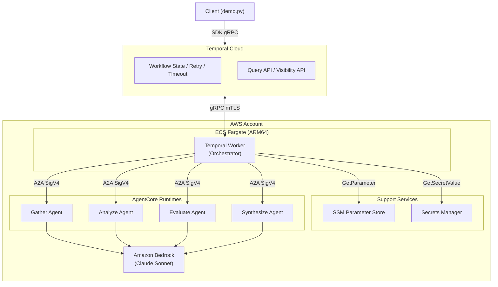
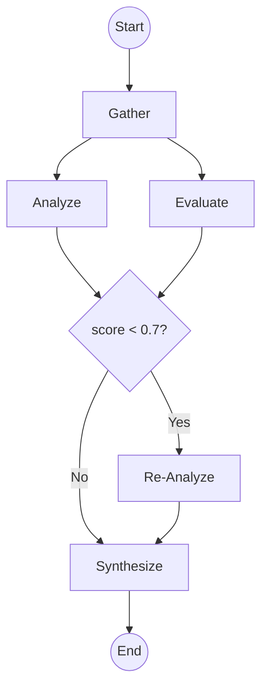

# Variant A: Temporal版

Temporal CloudでDAGフローを実行する本番向け構成。フロー定義はPythonのTemporal Workflowとして記述する。

## アーキテクチャ



## DAGフロー図



- **gather**: 情報収集（Web検索、コンテンツ抽出）
- **analyze / evaluate**: fan-out で並列実行。分析と品質評価を同時に行う
- **条件分岐**: evaluate のスコアが 0.7 未満の場合のみ re_analyze を実行
- **synthesize**: fan-in。分析結果と評価結果を統合して最終出力を生成

## フロー定義 (Python)

```python
# workflow/flows/research_pipeline.py
from temporalio import workflow
from temporalio.common import RetryPolicy
from datetime import timedelta
import asyncio

@workflow.defn
class ResearchPipelineWorkflow:
    def __init__(self):
        self._status = {}

    @workflow.run
    async def run(self, input_data: dict) -> dict:
        # Step 1: gather
        self._status["gather"] = "running"
        gathered = await workflow.execute_activity(
            "invoke_agent",
            args=["gather", input_data],
            start_to_close_timeout=timedelta(minutes=10),
            retry_policy=RetryPolicy(maximum_attempts=2),
        )
        self._status["gather"] = "completed"

        # Step 2: fan-out (analyze + evaluate 並列)
        self._status["analyze"] = "running"
        self._status["evaluate"] = "running"
        analyzed, evaluated = await asyncio.gather(
            workflow.execute_activity(
                "invoke_agent",
                args=["analyze", gathered],
                start_to_close_timeout=timedelta(minutes=10),
                retry_policy=RetryPolicy(
                    maximum_attempts=3,
                    backoff_coefficient=2.0,
                    initial_interval=timedelta(seconds=2),
                ),
            ),
            workflow.execute_activity(
                "invoke_agent",
                args=["evaluate", gathered],
                start_to_close_timeout=timedelta(minutes=10),
                retry_policy=RetryPolicy(maximum_attempts=2),
            ),
        )
        self._status["analyze"] = "completed"
        self._status["evaluate"] = "completed"

        # Step 3: 条件分岐
        score = evaluated.get("score", 1.0)
        if score < 0.7:
            self._status["re_analyze"] = "running"
            analyzed = await workflow.execute_activity(
                "invoke_agent",
                args=["analyze", {"original": analyzed, "feedback": evaluated.get("feedback", "")}],
                start_to_close_timeout=timedelta(minutes=10),
                retry_policy=RetryPolicy(maximum_attempts=2),
            )
            self._status["re_analyze"] = "completed"
        else:
            self._status["re_analyze"] = "skipped"

        # Step 4: fan-in (synthesize)
        self._status["synthesize"] = "running"
        result = await workflow.execute_activity(
            "invoke_agent",
            args=["synthesize", {"analysis": analyzed, "evaluation": evaluated}],
            start_to_close_timeout=timedelta(minutes=10),
            retry_policy=RetryPolicy(maximum_attempts=2),
        )
        self._status["synthesize"] = "completed"
        return result

    @workflow.query
    def get_status(self) -> dict:
        return self._status
```

```python
# workflow/activities.py
from temporalio import activity
from a2a_client import invoke_agent as _invoke

@activity.defn
async def invoke_agent(agent_name: str, input_data: dict) -> dict:
    return await _invoke(agent_name, input_data)
```

```python
# workflow/main.py
import asyncio, os
from temporalio.client import Client
from temporalio.worker import Worker
from flows.research_pipeline import ResearchPipelineWorkflow
from activities import invoke_agent

async def main():
    client = await Client.connect(
        os.environ["TEMPORAL_ADDRESS"],
        namespace=os.environ["TEMPORAL_NAMESPACE"],
        api_key=os.environ.get("TEMPORAL_API_KEY"),
    )
    worker = Worker(
        client,
        task_queue="daf-orchestrator",
        workflows=[ResearchPipelineWorkflow],
        activities=[invoke_agent],
    )
    await worker.run()

asyncio.run(main())
```

## デモ実行

```bash
cd workflow
source .venv/bin/activate

export TEMPORAL_ADDRESS="<namespace>.tmprl.cloud:7233"
export TEMPORAL_NAMESPACE="<namespace>"
export TEMPORAL_API_KEY="<your-api-key>"

python demo.py "AWS Bedrock AgentCoreの概要を調査してください"
```

出力例:

```
============================================================
  Research Pipeline
  Query: AWS Bedrock AgentCoreの概要を調査してください
  Workflow ID: demo-52b524a2
============================================================

DAG: gather → [analyze | evaluate] → (re_analyze?) → synthesize

Progress:
  ✅ gather: completed
  ✅ analyze: completed
  ✅ evaluate: completed
  ⏭️ re_analyze: skipped
  ✅ synthesize: completed

============================================================
  Result:
============================================================

(調査結果がここに表示されます)
```

Temporal UI (https://cloud.temporal.io) でもフロー実行状況を確認できます。

## ステータス管理

Temporalが自動提供。追加インフラ不要。

| 機能 | 詳細 |
|---|---|
| 実行状態 | Running / Completed / Failed / Timed Out / Cancelled |
| Activity状態 | Scheduled → Started → Completed / Failed / Retried |
| Query | `handle.query("get_status")` でWorkflow内部状態をリアルタイム取得 |
| 実行履歴 | Event History（全イベント永続化） |
| 検索 | Visibility API で workflow_id, status, 時刻でフィルタ |
| UI | Temporal UI でフロー可視化 |

## インフラ仕様

リポジトリ構成、デプロイ、IAM、ネットワーク、スケーリング、コストについては [specs-temporal.md](specs-temporal.md) を参照。
