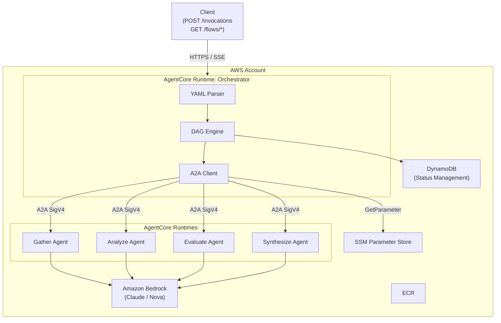
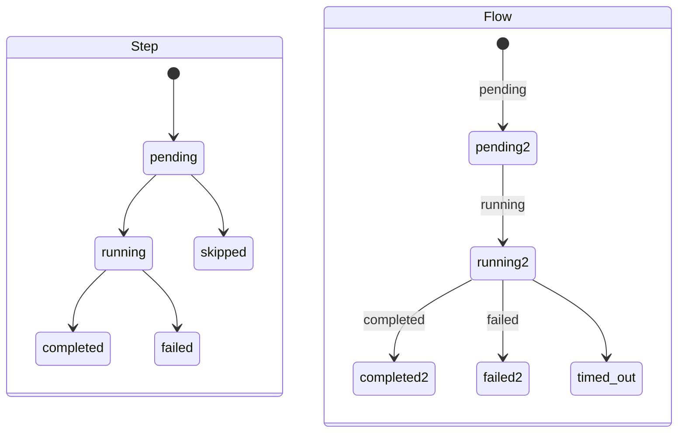

# Variant B: YAML-Based DAG Engine

A lightweight variant with no external dependencies. Flow definitions are written in YAML (GitHub Actions-style) and executed by a built-in DAG engine.

## Architecture



## Flow Definition (YAML)

```yaml
# orchestrator/flows/research-pipeline.yaml
name: research-pipeline
version: "1.0"

agents:
  gather:
    arn_param: /agents/gather/arn
  analyze:
    arn_param: /agents/analyze/arn
  evaluate:
    arn_param: /agents/evaluate/arn
  synthesize:
    arn_param: /agents/synthesize/arn

steps:
  - id: gather
    agent: gather
    input: $.input

  - id: analyze
    agent: analyze
    input: $.steps.gather.output
    depends_on: [gather]
    retry:
      max_attempts: 3
      backoff: exponential
      initial_delay_sec: 2

  - id: evaluate
    agent: evaluate
    input: $.steps.gather.output
    depends_on: [gather]

  - id: re_analyze
    agent: analyze
    input:
      original: $.steps.analyze.output
      feedback: $.steps.evaluate.output.feedback
    depends_on: [analyze, evaluate]
    condition: $.steps.evaluate.output.score < 0.7

  - id: synthesize
    agent: synthesize
    input:
      analysis: $.steps.re_analyze.output ?? $.steps.analyze.output
      evaluation: $.steps.evaluate.output
    depends_on: [analyze, evaluate, re_analyze]

output: $.steps.synthesize.output
timeout_sec: 3600
```

### YAML Specification

#### steps

| Field | Required | Description |
|---|---|---|
| `id` | yes | Unique identifier for the step |
| `agent` | yes | Agent name defined in the `agents` section |
| `input` | yes | Input mapping via JSONPath |
| `depends_on` | no | Step IDs this step depends on. Executes after all complete |
| `condition` | no | Condition expression. Step is skipped (output = null) if false |
| `retry` | no | Retry configuration |

#### Input Mapping

```yaml
# Scalar reference
input: $.input.query

# Object construction
input:
  analysis: $.steps.analyze.output
  evaluation: $.steps.evaluate.output

# Fallback (use right side if left is null)
input: $.steps.re_analyze.output ?? $.steps.analyze.output
```

State structure:
```json
{
  "input": { ... },
  "steps": {
    "gather": { "output": { ... } },
    "analyze": { "output": { ... } }
  }
}
```

#### condition

```yaml
# Comparison operators: <, >, <=, >=, ==, !=
condition: $.steps.evaluate.output.score < 0.7

# Logical operators: AND, OR, NOT
condition: $.steps.a.output.ready AND $.steps.b.output.count > 0
```

#### retry

```yaml
retry:
  max_attempts: 3           # Maximum attempts (default: 1 = no retry)
  backoff: exponential      # exponential | fixed
  initial_delay_sec: 2      # Initial wait in seconds
```

#### Comparison with GitHub Actions

| GitHub Actions | DAF YAML |
|---|---|
| `needs: [a, b]` | `depends_on: [a, b]` |
| `if: steps.x.outputs.y` | `condition: $.steps.x.output.y` |
| `uses: actions/xxx` | `agent: xxx` |
| `with:` | `input:` |
| `${{ steps.x.outputs.y }}` | `$.steps.x.output.y` |

## Execution Model

```python
# orchestrator/main.py
import re
from pathlib import Path

from bedrock_agentcore import BedrockAgentCoreApp
from engine import FlowEngine
import json, uuid

app = BedrockAgentCoreApp()

FLOWS_DIR = Path(__file__).parent / "flows"
FLOW_NAME_PATTERN = re.compile(r"^[a-z0-9][a-z0-9_-]{0,63}$")


@app.entrypoint
async def handler(event):
    flow_id = str(uuid.uuid4())
    flow_name = event["flow"]

    if not FLOW_NAME_PATTERN.match(flow_name):
        yield json.dumps({"event": "error", "message": "Invalid flow name"})
        return

    flow_path = (FLOWS_DIR / f"{flow_name}.yaml").resolve()
    if not flow_path.is_relative_to(FLOWS_DIR.resolve()):
        yield json.dumps({"event": "error", "message": "Invalid flow name"})
        return

    engine = FlowEngine(flow_path, flow_id)
    yield json.dumps({"event": "flow_started", "flow_execution_id": flow_id})

    async for progress in engine.run(event.get("input", {})):
        yield json.dumps(progress)

app.run()
```

```python
# orchestrator/engine.py
import asyncio, yaml, time
from pathlib import Path
from dag import topological_batches, Step
from resolver import resolve_input, evaluate_condition
from retry import with_retry
from a2a_client import invoke_agent
from status_store import StatusStore

class FlowEngine:
    def __init__(self, flow_path: Path, flow_id: str):
        with open(flow_path) as f:
            self.flow = yaml.safe_load(f)
        self.store = StatusStore(flow_id, self.flow.get("name", flow_path.stem))
        self.state = {}

    async def run(self, input_data: dict):
        self.state = {"input": input_data, "steps": {}}
        timeout = self.flow.get("timeout_sec", 3600)
        start = time.time()

        steps = [Step(
            id=s["id"], agent=s["agent"], input=s.get("input"),
            depends_on=s.get("depends_on", []),
            condition=s.get("condition"), retry=s.get("retry"),
        ) for s in self.flow["steps"]]

        for batch in topological_batches(steps):
            if time.time() - start > timeout:
                self.store.flow_timed_out()
                yield {"event": "error", "message": "Flow timeout exceeded"}
                return

            tasks = []
            batch_steps = []
            for step in batch:
                if not evaluate_condition(step.condition, self.state):
                    self.state["steps"][step.id] = {"output": None}
                    self.store.step_skipped(step.id)
                    yield {"event": "step_skipped", "step": step.id}
                    continue
                resolved = resolve_input(step.input, self.state)
                tasks.append(self._execute_step(step, resolved))
                batch_steps.append(step)

            results = await asyncio.gather(*tasks, return_exceptions=True)

            for step, result in zip(batch_steps, results):
                if isinstance(result, Exception):
                    self.store.step_failed(step.id, str(result))
                    self.store.flow_failed(str(result))
                    yield {"event": "step_failed", "step": step.id, "error": str(result)}
                    return
                self.state["steps"][step.id] = {"output": result}
                self.store.step_completed(step.id, result)
                yield {"event": "step_completed", "step": step.id}

        final_output = resolve_input(self.flow["output"], self.state)
        self.store.flow_completed(final_output)
        yield {"event": "flow_completed", "output": final_output}

    async def _execute_step(self, step: Step, input_data):
        agent_config = self.flow["agents"][step.agent]
        self.store.step_started(step.id)

        async def _invoke():
            return await invoke_agent(agent_config["arn_param"], input_data)

        return await with_retry(_invoke, step.retry)
```

```python
# orchestrator/status_store.py
import boto3, time

dynamodb = boto3.resource("dynamodb")
table = dynamodb.Table("daf-flow-executions")

class StatusStore:
    def __init__(self, flow_id: str, flow_name: str):
        self.pk = f"flow#{flow_id}"
        self._write("META", {
            "status": "running", "flow_name": flow_name,
            "started_at": int(time.time()),
            "ttl": int(time.time()) + 86400 * 30,
        })

    def step_started(self, step_id: str):
        self._write(f"step#{step_id}", {"status": "running", "started_at": int(time.time())})

    def step_completed(self, step_id: str, output: dict):
        self._write(f"step#{step_id}", {"status": "completed", "output": output, "completed_at": int(time.time())})

    def step_failed(self, step_id: str, error: str):
        self._write(f"step#{step_id}", {"status": "failed", "error": error})

    def step_skipped(self, step_id: str):
        self._write(f"step#{step_id}", {"status": "skipped"})

    def flow_completed(self, output: dict):
        self._write("META", {"status": "completed", "output": output, "completed_at": int(time.time())})

    def flow_failed(self, error: str):
        self._write("META", {"status": "failed", "error": error})

    def flow_timed_out(self):
        self._write("META", {"status": "timed_out"})

    def _write(self, sk: str, data: dict):
        table.put_item(Item={"pk": self.pk, "sk": sk, **data})
```

## Client Operations

```bash
# Option 1: SSE stream (real-time)
POST /invocations
{"flow": "research-pipeline", "input": {"query": "..."}}

# Response
data: {"event": "flow_started", "flow_execution_id": "abc123"}
data: {"event": "step_completed", "step": "gather"}
data: {"event": "step_completed", "step": "analyze"}
data: {"event": "step_completed", "step": "evaluate"}
data: {"event": "step_skipped", "step": "re_analyze"}
data: {"event": "step_completed", "step": "synthesize"}
data: {"event": "flow_completed", "output": {...}}

# Option 2: Status API (after SSE disconnection)
GET /flows/abc123/status
-> {
    "flow_execution_id": "abc123",
    "status": "running",
    "steps": {
      "gather": {"status": "completed"},
      "analyze": {"status": "running"},
      "evaluate": {"status": "completed"},
      "synthesize": {"status": "pending"}
    }
  }

# Option 3: Retrieve result
GET /flows/abc123/output
-> {"output": {...}}
```

## Status Management (DynamoDB)

```
Table: daf-flow-executions
Billing: PAY_PER_REQUEST
TTL: Auto-delete after 30 days

PK: flow#{flow_execution_id}
SK: META | step#{step_id}
```

State transitions:



## Infrastructure Specifications

For repository structure, deployment, IAM, networking, scaling, and cost details, see [specs-yaml.md](specs-yaml.md).

## Constraints

- AgentCore Runtime session timeout: 15 minutes idle (extend with `add_async_task`)
- Flow-level timeout: 8 hours maximum
- Flow resumption on VM failure: Not supported (re-execute the flow)
