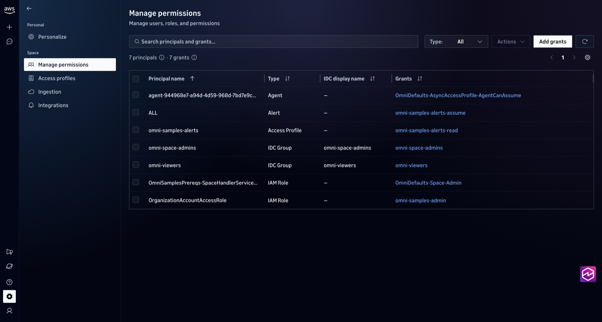

# 00 — Prerequisites (CDK)

One CDK stack, `OmniSamplesPrereqs`, sets up everything samples 01–04 need before telemetry can show up in Omni.

| Resource | Why |
|---|---|
| **Space access role** (`CloudWatchOmniSpaceAccessPolicy`, plus optional `…ModelInferencePolicy` and `…AWSIntegrationPolicy`) | Omni assumes it to operate the space. The trust policy is `cloudwatch.amazonaws.com` with `sts:AssumeRole`, `sts:TagSession`, and `sts:SetContext`, plus `aws:SourceAccount`/`aws:SourceArn` conditions |
| **Dataset integration** + its role (`AWS::ObservabilityAdmin::DatasetIntegration`) | Forwards CloudWatch logs and traces into the space's Dataset. Without it, telemetry reaches CloudWatch but never Omni. One per account per Region, so the stack skips it when it adopts a space that already has one (see `createDatasetIntegration`) |
| **Omni space** (`Custom::OmniSpace`) | Where you work. CloudFormation has no Omni resource types yet, so a Lambda custom resource calls `CreateSpace` with a bundled boto3 1.43+ |
| **Access grants**: Identity Center groups `omni-space-admins` → Space Admin, `omni-viewers` → Viewer; optional IAM role → Space Admin | People sign in with SSO through the groups (created by `enable_sso.py`). The IAM grant is for automation: managing grants, such as sample 04's alert profile, needs a grant of its own |
| Transaction Search (`AWS::XRay::TransactionSearchConfig`) + its X-Ray→Logs resource policy, *opt-in* | Account-level setting, so it's off by default and always **retained**. Turn it on for the first deploy in an account where it's off |
| Log group `/omni-samples/shop` + stream `default` | Destination for sample 02's OTLP logs |
| SNS topic `omni-samples-alerts` with a `cloudwatch.amazonaws.com` publish policy | Notification target for sample 04's alerts |

Not included: the **domain**. There is one per account (or per organization), and it's usually created once in the console. The stack attaches the space to the existing domain you pass in.

## Before you deploy

```bash
aws sts get-caller-identity                  # confirm the account. Use a sandbox, not production
aws cloudwatchomni list-domains --region us-east-1     # needs AWS CLI 2.37.0+ (see the main README)
aws xray get-trace-segment-destination --region $AWS_REGION   # CloudWatchLogs/ACTIVE means Transaction Search is on
```

**Which account to deploy into.** It depends on the domain type:

| Your domain | Deploy this stack into |
|---|---|
| **Organization domain** (`aws cloudwatchomni list-domains` shows an `organization-domain/` ARN) | A **member account** of that organization. The management account that owns the domain **cannot create a space**. `CreateSpace` fails with `The organization management account cannot create a space.` |
| **Account domain** (`domain/` ARN) | The account that owns the domain |

`common/preflight.sh` warns when your credentials are for the management account. To act in a member account, set `OMNI_MEMBER_ROLE_ARN` in `.env` (for example `arn:aws:iam::<member-acct>:role/OrganizationAccountAccessRole`) and source the helper before `cdk` or any sample:

```bash
source common/assume-member-role.sh      # run from the repo root; credentials last ~1 hour, re-source to refresh
```

It exports temporary member-account credentials, so the CLI, boto3, the CDK, and `docker compose` all act in that account. A named `AWS_PROFILE` is **not** enough when your shell already has `AWS_ACCESS_KEY_ID` set (SSO or credential helpers): the SDKs prefer those variables and silently stay in the management account. When the base credentials came from environment variables, refresh in the original shell; a nested child shell intentionally does not inherit the saved management-account secret keys. Prefer a named management profile when every new shell must switch accounts independently.

Also set `OMNI_ADMIN_PRINCIPAL_ARN` to a principal **in that member account**, such as the same `OrganizationAccountAccessRole`. Grants must name a principal in the space's own account.

Quotas to know: **one domain per account**, **one space per account per Region**, and **one dataset integration per account per Region**. If a space already exists in the target Region, the deploy fails with a clear message. Re-run with `-c adoptExistingSpace=true` to manage that space from the stack instead; adopting also skips creating a dataset integration, because a space set up in the console already has one.

**Use one Region for everything.** Put the space in the Region of your Omni domain **and** your IAM Identity Center instance (here `us-east-1`). Identity Center sign-in then needs no multi-Region replication. The samples, alerts, and evaluations all run in that Region.

## Step A: SSO sign-in (management account, once)

People should reach Omni through IAM Identity Center rather than by switching into the member account. `enable_sso.py` adds Identity Center sign-in to the organization domain (IAM sign-in stays on for automation and break-glass). It creates two least-privilege groups and writes their IDs into `.env`. Run it with **management-account** credentials. In a shell that already sourced `assume-member-role.sh`, it recovers the management session automatically when the base source was a named profile or the default credential chain. If the base credentials were explicit environment variables, run `enable_sso.py` before switching or from a separate management-account shell; those secret keys are intentionally not exported to child processes.

```bash
cd 00-prerequisites
python3 -m venv .venv && . .venv/bin/activate && pip install -r requirements.txt   # reused in Step B
python enable_sso.py                                              # dry run
python enable_sso.py --apply --admin-user <idc-user-name> --viewer-user <idc-user-name>
```

| Group | Permission on the space | Who |
|---|---|---|
| `omni-space-admins` | Space Admin | A few people who manage members |
| `omni-viewers` | Viewer (read-only, including queries and the Omni agent) | Everyone else |

Manage access from then on through group membership in Identity Center, not per-person grants. Re-running the script is safe. `--admin-user`/`--viewer-user` take Identity Center **user names**.

**Account domain?** `enable_sso.py` handles organization domains only. Connect Identity Center to the domain as described in [Set up Omni for a single account](https://docs.aws.amazon.com/AmazonCloudWatch/latest/monitoring/omni-set-up-omni-for-a-single-account.html), create the two groups in Identity Center yourself, and put their IDs in `.env` as `OMNI_ADMIN_GROUP_ID` / `OMNI_VIEWER_GROUP_ID`. Or skip SSO and sign in with the IAM principal in `OMNI_ADMIN_PRINCIPAL_ARN`.

## Step B: Deploy the stack (member account)

The app reads its settings from the repo's `../.env`, the same file the samples use:

```bash
# ../.env
AWS_REGION=us-east-1                                            # same Region as the domain and Identity Center
OMNI_DOMAIN_ID=<domain-name-or-id>                              # aws cloudwatchomni list-domains
OMNI_MEMBER_ROLE_ARN=arn:aws:iam::<member>:role/OrganizationAccountAccessRole   # organization domains only
OMNI_ADMIN_GROUP_ID=<written by enable_sso.py>
OMNI_VIEWER_GROUP_ID=<written by enable_sso.py>
OMNI_ADMIN_PRINCIPAL_ARN=arn:aws:iam::<member>:role/OrganizationAccountAccessRole # automation/break-glass Space Admin
```

Then:

```bash
source common/assume-member-role.sh               # organization domain: act in the member account
common/preflight.sh                                # Transaction Search line tells you whether to enable it below

cd 00-prerequisites
python3 -m venv .venv && . .venv/bin/activate     # use this venv, not the one from sample 01
pip install -r requirements.txt

cdk bootstrap        # once per account/Region; skip if CDKToolkit already exists there
cdk diff
cdk deploy           # add -c enableTransactionSearch=true if preflight showed it OFF (first deploy only)
                     # add -c alertEmail=you@example.com to subscribe to the alerts topic

./write_env.sh            # copies OMNI_SPACE_ID, SHOP_LOG_GROUP, ALERTS_TOPIC_ARN into ../.env
../common/preflight.sh    # should now show the space as ACTIVE
```

Any `-c key=value` on the command line overrides `.env`. Without `OMNI_DOMAIN_ID` (or `-c domainId=…`), every `cdk` command stops with `ValueError: No Omni domain set`, because each one builds the app first.

Docker is **not** required: the Lambda bundle is built with a local `pip install`. Synth prints one expected warning, `Unknown resource type 'AWS::ObservabilityAdmin::DatasetIntegration'`, because CDK's bundled spec predates that registry type. It deploys normally.

### Context options

| `-c` key | Default | Notes |
|---|---|---|
| `domainId` | `OMNI_DOMAIN_ID` from `.env` (required) | Domain ID, name, or ARN |
| `spaceName` | `omni-samples` | 3–64 chars, lowercase letters, digits, and hyphens |
| `adminGroupId` / `viewerGroupId` | `OMNI_ADMIN_GROUP_ID` / `OMNI_VIEWER_GROUP_ID` from `.env` | Identity Center group IDs. They get Space Admin / Viewer |
| `adminPrincipalArn` | `OMNI_ADMIN_PRINCIPAL_ARN` from `.env` | IAM role/user ARN (an sts assumed-role ARN is converted to its role; roles with a path need the full IAM role ARN). Gets `SPACE_ADMIN` |
| `agentCoreEvaluationRoleArn` | — | Optional evaluation execution role for the space (trust: `bedrock-agentcore.amazonaws.com`) |
| `attachModelInferencePolicy` | `true` | Prompt playground and judge-model evaluations from the Omni UI |
| `attachAwsIntegrationPolicy` | `true` | Context graph resource discovery. It reads resource metadata across the account |
| `enableTransactionSearch` | `false` | Set `true` only for the first deploy in an account where preflight shows it off. It takes about 10 minutes to go `PENDING`→`ACTIVE`. The setting and its logs policy are retained by the stack, so later deploys omit the flag |
| `adoptExistingSpace` | `false` | Manage a space that already exists in the Region. Adopted spaces are never deleted by the stack |
| `createDatasetIntegration` | `true`, or `false` when `adoptExistingSpace=true` | Observability Admin allows one dataset integration per account per Region. A space created in the console already has one, so adopting it skips creating a second (which would fail and roll the stack back). Synth warns whenever it skips. Set `true` to adopt a space that has no integration — a space created by `CreateSpace` rather than the console, or one whose integration you deleted. **Set it in `cdk.json` rather than with `-c` if you need it on every deploy**: dropping the flag on a later deploy removes the integration from the stack, which orphans it (with `retainSpaceOnDelete=true`) or deletes it and stops all forwarding (with `false`) |
| `retainSpaceOnDelete` | `true` | Keep the space (and its telemetry) when the stack is destroyed |
| `shopLogGroupName` | `SHOP_LOG_GROUP` from `.env`, else `/omni-samples/shop` | |
| `alertEmail` | — | Email subscription on the alerts topic (confirm the email) |

## Verify

```bash
aws cloudformation describe-stacks --stack-name OmniSamplesPrereqs --query 'Stacks[0].Outputs' --region $AWS_REGION
aws cloudwatchomni get-space --space-id <SpaceId> --region $AWS_REGION      # status ACTIVE
aws cloudwatchomni list-access-grants --space-id <SpaceId> --region $AWS_REGION
```

Expect five grants. Three are customer-managed: `omni-space-admins` (`IDC_GROUP`, `SPACE_ADMIN`), `omni-viewers` (`IDC_GROUP`, `READ`), and the automation role (`IAM_ROLE`, `SPACE_ADMIN`). Two are service-managed: `SPACE_ADMIN` for the custom resource's Lambda role (it created the space) and a `CUSTOM` grant for the space's built-in agent.



*Settings › Manage permissions after step 0. This space also ran sample 04, so it shows two more principals: the `omni-samples-alerts` access profile and the `ALL` alert trust grant.*

**Sign in.** Open the `DomainEndpointUrl` output, for example `https://<domain>.cloudwatch-omni.global.app.aws`, and sign in with **IAM Identity Center** as a member of `omni-space-admins` or `omni-viewers`. No AWS console access, role switching, or management-account access is needed. Group membership changes apply at the next authorization-cache refresh (minutes); sign out and in again if a new member doesn't see the space yet.

**Smoke test (about 3 minutes):**

```bash
cd ../01-agent-observability && python3 -m venv .venv && . .venv/bin/activate && pip install -r requirements.txt
./run.sh --sessions 4
sleep 120 && python ../common/omni_query.py queries/agent_turns.sql --var service=support-agent   # rows = it works
```

**The space was created but you get an authorization error when you use it?** `CreateSpace` never checks that the role can be assumed. Check the space access role's trust policy before anything else: principal, all three `sts` actions, and both conditions. Don't recreate the space; a new space with the same role fails the same way.

**`The organization management account cannot create a space.`** You deployed into the account that owns an organization domain. Switch to a member-account profile (see *Which account to deploy into*). The failed create rolls back cleanly. CDK replaces a stack left in `ROLLBACK_COMPLETE` on the next `cdk deploy`, or you can run `cdk destroy` first.

**Stack in `ROLLBACK_FAILED` with `TransactionSearch` `DELETE_FAILED` ("Updates are not allowed while the current status is PENDING").** An older version of this stack let a failed first deploy try to turn Transaction Search off while it was still activating. The current stack retains it. To recover, keep the account-wide setting and its policy:

```bash
aws cloudformation delete-stack --stack-name OmniSamplesPrereqs            # -> DELETE_FAILED on TransactionSearch
aws cloudformation delete-stack --stack-name OmniSamplesPrereqs \
    --retain-resources TransactionSearch XRayToLogsPolicy                   # allowed only in DELETE_FAILED
cdk deploy                                                                  # without enableTransactionSearch
```

**`Unable to validate Identity Center availability for region <r>`** on `CreateSpace`. With an Identity Center domain, the caller (the custom resource's role) needs `sso:ListRegions` and the space must be in a Region where Identity Center is available. The stack grants the read-only `sso:*`/`identitystore:Describe*` it needs. Keep the space in the Identity Center Region, or enable multi-Region replication for the space's Region.

**`Caller has no grants in this domain and cannot manage grants`.** Creating grants (for example `setup_alert_profile.py`) needs a grant of your own on the space, even as an IAM admin. Set `OMNI_ADMIN_PRINCIPAL_ARN` to the automation role you run scripts as and redeploy. New grants take effect after about 3 minutes.

**`AccessDeniedException ... GetDomainForOrganization`.** Only the management account can read an organization domain. The handler now falls back to the documented sign-in URL format, so update to the current code and redeploy.

**`AccessDenied` on `cloudwatch:*` or `iam:PassRole` in the stack events?** The custom resource's Lambda role carries only the Omni actions it calls. Quote the denied action from the CloudFormation event and add it to `SpaceHandler`'s policy in `omni_prereqs/stack.py`.

## Destroy

```bash
cdk destroy
```

The Lambda, log groups, and topic are removed. By default (`retainSpaceOnDelete=true`) the **space, its access role, and the dataset integration (and its role) are retained**, because deleting a space permanently destroys its telemetry, and a kept space still needs its role and forwarding.

A retained Dataset integration keeps forwarding every log group in the account into the Dataset, so the retained space keeps ingesting (and billing for) logs after the stack is gone.

**Destroy/redeploy requires an extra lifecycle step.** Observability Admin allows one dataset integration per account per Region, and `adoptExistingSpace=true` adopts only the retained space—not that integration. Redeploying with `-c adoptExistingSpace=true` therefore skips creating one (`createDatasetIntegration` defaults to `false` when adopting) and leaves the retained integration forwarding, unmanaged by the stack. To bring it back under the stack, either import the retained integration and its role into the replacement stack, or delete both the retained integration and its retained `DatasetIntegrationRole` and redeploy with `-c adoptExistingSpace=true -c createDatasetIntegration=true`. Deleting the integration stops forwarding until the new deployment completes; leaving the old role behind means an orphaned IAM role alongside the new one.

To remove everything, first deploy with `-c retainSpaceOnDelete=false`, then destroy. Only do that once you're sure you no longer need the telemetry. Verified on a fresh account deployed with the defaults: that leaves no space, Omni stacks, sample IAM roles, Dataset integration, log group, or topic behind. Transaction Search, its logs resource policy, the `aws/spans` log group, and `CDKToolkit` stay on purpose.

**On the adopt path, the integration is not the stack's to delete.** With `createDatasetIntegration=false` there is no integration in the template, so neither `retainSpaceOnDelete=false` nor `cdk destroy` touches the one that is forwarding. Delete it yourself when you're done: `aws observabilityadmin list-dataset-integrations`, then `delete-dataset-integration`, and remove its role.
