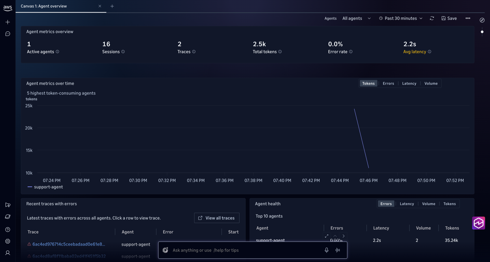

# 01 — AI agent observability

A Strands Agents customer-support agent for "AnyCompany Shop" on Amazon Bedrock, instrumented with the AWS Distro for OpenTelemetry (ADOT). It reproduces the Omni docs' quality-regression scenario.

1. **Observe.** Every turn becomes a trace with the agent span, model calls (tokens, latency), and tool calls (`lookup_order`, `get_refund_policy`, `start_return`).
2. **Catch a silent failure.** Prompt `v1` has no scope guardrail, so the agent cheerfully answers "give me a cookie recipe". The response is well-formed, raises no error, and generic helpfulness scores it high. A custom LLM-as-judge evaluator, `ScopeAdherence`, flags it.
3. **Fix and verify.** Switch to prompt `v2`, keep online evaluation running, and compare scores before and after with one SQL query.

## Run it

> **Organization domain?** Run `source common/assume-member-role.sh` from the repo root in this shell first, so everything below acts in the member account that owns the space (see the main README).

```bash
cd 01-agent-observability
python3 -m venv .venv && . .venv/bin/activate
pip install -r requirements.txt

./run.sh --sessions 20                 # prompt v1, mixed in-scope and off-topic traffic
```

`run.sh` sets the environment from the docs' **Send AI agent telemetry › Amazon EC2 › Python** section and launches `opentelemetry-instrument python run_agent.py`. Traces go straight to `https://xray.<region>.amazonaws.com/v1/traces`, SigV4-signed with your credentials. Your identity needs `AWSXrayWriteOnlyAccess` plus `bedrock:InvokeModel*` on `MODEL_ID`. The default `MODEL_ID` is Amazon Nova 2 Lite (`us.amazon.nova-2-lite-v1:0`). To use Claude instead, submit the Anthropic use-case form for the account first. Otherwise every turn fails with `Model use case details have not been submitted for this account`, and the traces show the agent spans as `ERROR`.

## See it in Omni

Allow 1–3 minutes after the first run.

| Where | What to look at |
|---|---|
| **Agents** › `support-agent` | Sessions, turns, token usage, latency, tool error rate |
| A trace | `invoke_agent` → `chat` (model) → `execute_tool lookup_order` → `chat`, with prompts and responses on the spans |
| **Omni agent** (chat) | Ask *"Which tools did support-agent call most in the last hour, and did any fail?"* |
| **Explore** (SQL) | Paste any file from [`queries/`](queries/) |



*Agent overview after a few runs of `run.sh`.*

Or run the queries from your terminal:

```bash
python ../common/omni_query.py queries/agent_turns.sql  --var service=support-agent
python ../common/omni_query.py queries/token_usage.sql  --var service=support-agent
python ../common/omni_query.py queries/tool_calls.sql   --var service=support-agent
```

`ORD-9999` in `prompts.jsonl` doesn't exist, so `lookup_order` fails on purpose and you get tool-error spans to look at.

## Evaluate quality

### 1–2. Create the evaluator and turn on online evaluation (CDK, recommended)

[`evaluation/cdk`](evaluation/cdk) deploys the `ScopeAdherence` LLM-as-judge evaluator and an online evaluation config that scores live traffic with `Builtin.Helpfulness` and `ScopeAdherence`. The evaluator is TRACE level and judges `{assistant_turn}` against `{context}`, on a scale of 0 (violation), 0.5 (partial), 1 (in scope). The rubric is in [`evaluation/scope_adherence.json`](evaluation/scope_adherence.json). The CDK construct creates the evaluation execution role, so you don't write an IAM policy.

First confirm which log group holds the agent's spans. It's usually `aws/spans`. Never take it from `aws.log.group.names`: a wrong group goes ACTIVE and scores nothing, with no error.

```bash
python ../common/omni_query.py evaluation/find_span_log_groups.sql --var service=support-agent

cd evaluation/cdk
. ../../../00-prerequisites/.venv/bin/activate        # same CDK venv as step 0
cdk deploy                                             # -c logGroupNames=<group[,group]> if not aws/spans
cd ../..
```

The judge uses `JUDGE_MODEL_ID` from `.env` (default Amazon Nova Pro). The config is deployed with `executionStatus=ENABLED`. The construct's default is DISABLED, which looks ACTIVE and scores nothing. Sampling is 100% and the session timeout is 2 minutes, which suits demo volumes. Tune them with `-c samplingPercentage=` and `-c sessionTimeoutMinutes=`.

Only sessions that arrive **after** it's enabled are scored. Generate fresh traffic, and expect scores **about 5–15 minutes later** (session timeout plus evaluation time; the first run after deploying can take the longest):

```bash
./run.sh --sessions 12
```

### 3. Find the regression, fix it, and compare

```bash
python ../common/omni_query.py queries/eval_scores.sql      --var service=support-agent
python ../common/omni_query.py queries/scope_violations.sql --var service=support-agent --var evaluator=ScopeAdherence

PROMPT_VERSION=v2 ./run.sh --sessions 30                  # ship the fix

python ../common/omni_query.py queries/scores_by_prompt_version.sql --var service=support-agent
```

Expect `ScopeAdherence` to score low for `v1` on off-topic sessions and rise for `v2`. `Builtin.Helpfulness` stays high in both, which is why a scope-specific evaluator is needed. A verified run:

```
prompt_version  n   evaluator            avg_score
v1              28  ScopeAdherence       0.875     <- includes 0.0 "Violation" on poem / stock-tip requests
v2               3  ScopeAdherence       1.0
v1              28  Builtin.Helpfulness  0.79
v2               3  Builtin.Helpfulness  0.72
```


*Evaluation dashboard: online evaluation scores for `Builtin.Helpfulness` and `ScopeAdherence` over the past day.*

> **Where scores live:** evaluation results are **log records in `logs.default`**, filed under `gen_ai.evaluation.name`. Querying `traces.default` for them returns zero rows without an error. Online records use `service.name = 'support-agent.DEFAULT'`. Records with `error.type` set are jobs that failed to run, not low scores.

> **Custom evaluator names:** online records are filed under the evaluator **name** (`ScopeAdherence`). If `scope_violations.sql` returns nothing, run `eval_scores.sql` to see the exact names in use.

### Optional: the IDE loop

The CloudWatch Omni extension for VS Code, Cursor, and Kiro can import the failing sessions as a dataset, run experiments comparing `v1` and `v2` against it, and manage prompts. Experiments and prompt management are IDE-only. See *Tutorial: Fix a production quality regression* in the Omni docs.

## Cleanup

```bash
cd evaluation/cdk && cdk destroy     # removes the online evaluation config, the ScopeAdherence evaluator, and its role
```
