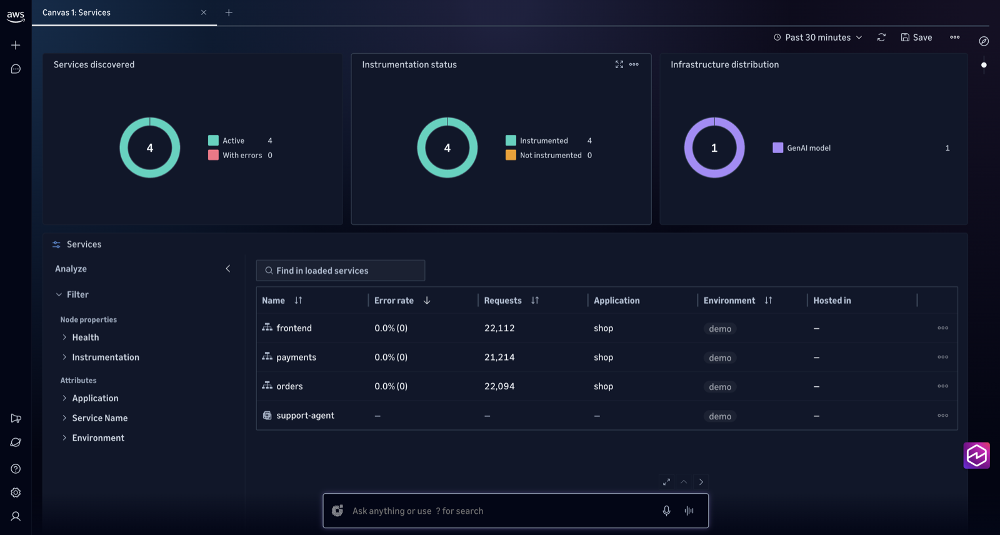

# 02 — Microservices / APM

A three-service FastAPI shop, `frontend → orders → payments`, auto-instrumented with OpenTelemetry. It shows how Omni builds the application view **without any manual configuration**:

* **Application map:** the services are grouped by `service.namespace=shop`, with edges discovered from instrumented outbound `httpx` calls.
* **RED metrics per service** from `cloudwatch-plugin-otel` span metrics (`traces.span.metrics.calls`, `traces.span.metrics.duration`).
* **Correlated logs** carry `traceId`, so you can jump from a slow trace to its error logs.
* **A fault you can inject** in `payments` (latency or 503s), so there is something real to investigate.

## Run it

> **Organization domain?** Run `source common/assume-member-role.sh` from the repo root in this shell first, so everything below acts in the member account that owns the space (see the main README).

You need Docker. Credentials come from your AWS CLI session (`CloudWatchAgentServerPolicy` covers the collector's writes).

```bash
# The OTLP logs endpoint writes to an existing log group and stream. Step 0 creates
# /omni-samples/shop and its "default" stream. Without step 0, create them by hand:
#   aws logs create-log-group  --log-group-name /omni-samples/shop --region $AWS_REGION
#   aws logs create-log-stream --log-group-name /omni-samples/shop --log-stream-name default --region $AWS_REGION

cd 02-microservices-apm
./up.sh                       # builds and starts collector + 3 services + load generator (about 2 req/s)
docker compose logs -f loadgen
```

Each service creates `FastAPI(..., telemetry={"auto_configure": False})`. FastAPI 0.140+ otherwise reads the same `OTEL_*` variables and adds a **second** OTLP exporter next to `opentelemetry-instrument`'s, so every span, metric, and log is sent twice. In testing that showed up as each span stored twice in Omni (`COUNT(*)` was 2× `COUNT(DISTINCT spanId)`). Keep the flag in any FastAPI app you run under `opentelemetry-instrument`.

`common/otel-collector.yaml` forwards traces, logs, and metrics to the CloudWatch OTLP endpoints with SigV4. If nothing shows up, run `docker compose logs otel-collector`. A 403 means credentials or permissions, and expired credentials mean you should re-run `./up.sh`.

## Walkthrough

### 1. Baseline (about 5 minutes after start)

* **Application map:** open the `shop` application. `frontend → orders → payments` should appear on its own.
* **A service** (`payments`): request rate, p99, error rate.
* **Trace Explorer:** a `POST /checkout` trace shows frontend's server span, its httpx client span, orders' server span, and the `POST /charge` client span into payments.

```bash
python ../common/omni_query.py queries/service_red.sql
```


*Application map, built from the telemetry alone. `support-agent` and its Bedrock model also appear because sample 01 ran in the same space.*



*Services: every instrumented service with its error rate and request count.*

### 2. Break payments

```bash
./chaos.sh both 2500 0.3      # +2.5s latency and 30% 503s on every payments call
```

Within a few minutes, payments p99 jumps to about 2.5 s and errors rise. Orders and frontend inherit the latency and turn the failures into 502s, so the map shows the blast radius upstream.

Investigate from three angles:

```bash
python ../common/omni_query.py queries/slowest_spans.sql --var service=payments
python ../common/omni_query.py queries/failed_spans.sql
python ../common/omni_query.py queries/error_logs_with_traces.sql --var log_group=/omni-samples/shop
python ../common/omni_query.py queries/trace_waterfall.sql --var trace_id=<traceId from above>
```

Or ask the **Omni agent**: *"Why did checkout latency spike in the last 15 minutes?"* It writes the queries and walks the dependency graph down to `payments`, where the `card_processor.authorize` child span and the `chaos.latency_ms` attribute give the cause away.

PromQL versions for dashboards and alerts are in [`queries/promql.md`](queries/promql.md).

### 3. Recover

```bash
./chaos.sh off
```

Leave the shop running if you're continuing to sample 03 or 04.

## Moving this to AWS compute

The app-side environment variables are identical on EC2/ECS/EKS. Only the collector changes. Use the CloudWatch agent: on EC2, `amazon-cloudwatch-agent-ctl -a fetch-config -c default:otel -s`; on ECS, a sidecar with `CW_CONFIG_CONTENT={"opentelemetry":{"collect":{"otlp":{}}}}` and `dependsOn: START`; on EKS, the `amazon-cloudwatch-observability` add-on. Point `OTEL_EXPORTER_OTLP_ENDPOINT` at it. See *Send application telemetry* in the Omni docs.

## Cleanup

```bash
docker compose down
# The log group belongs to step 0 (cdk destroy removes it). If you created it by hand:
#   aws logs delete-log-group --log-group-name /omni-samples/shop --region $AWS_REGION
```
