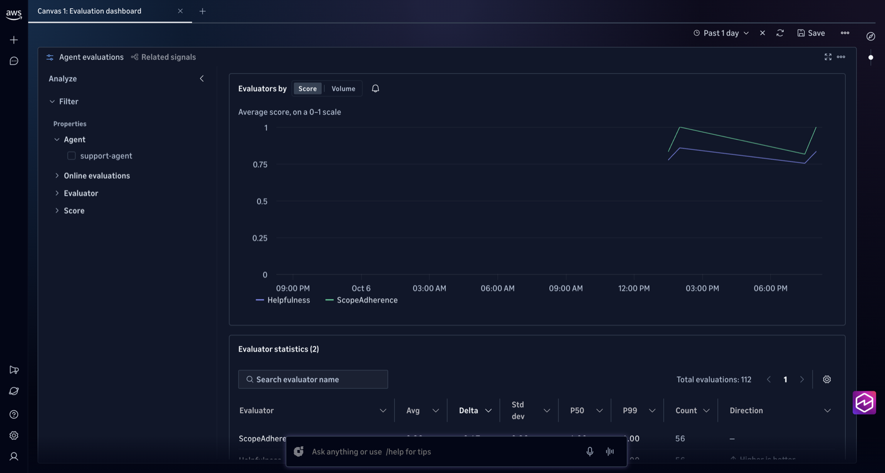
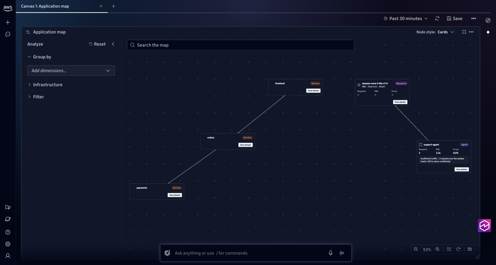
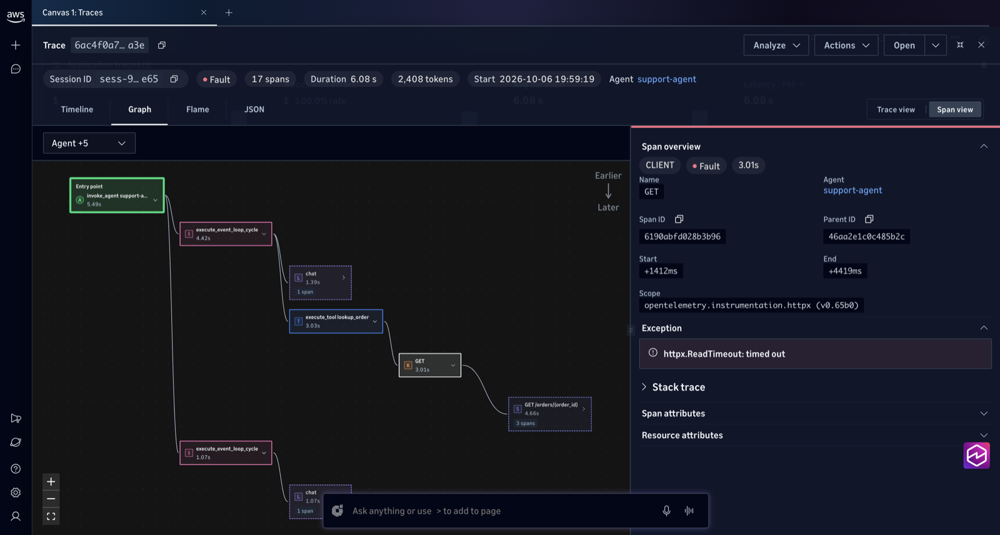
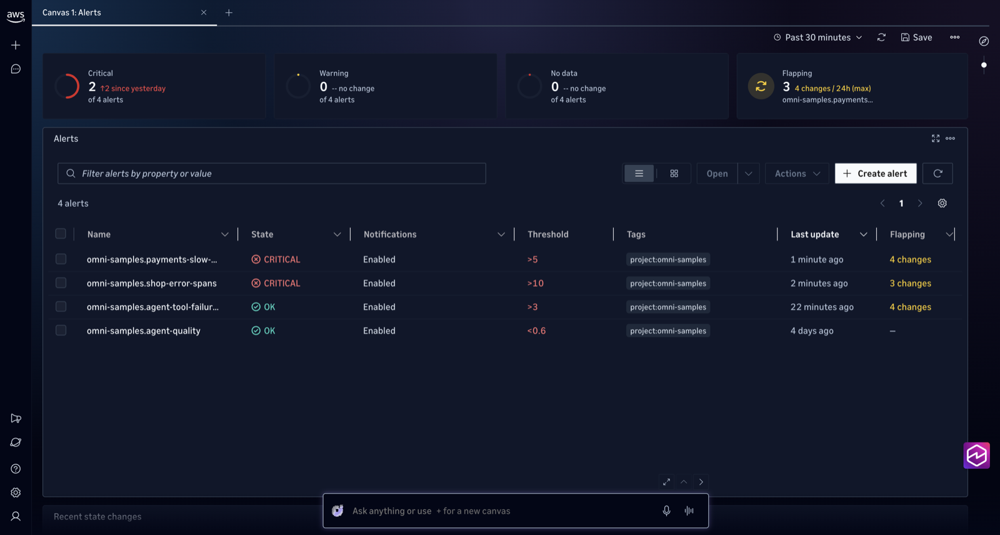
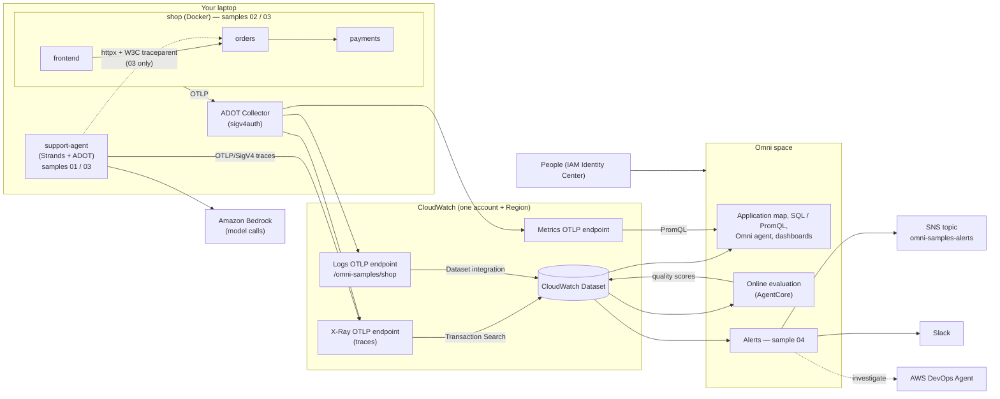

# CloudWatch Omni with sample use cases in Python

Runnable samples that exercise [Amazon CloudWatch Omni](https://docs.aws.amazon.com/AmazonCloudWatch/latest/monitoring/cloudwatch-omni.html)
end to end. Step 0 is a CDK stack that sets up the Omni space and the shared resources. The
samples themselves run on your laptop and send telemetry to CloudWatch in that account.

| # | Use case | What you see in Omni |
|---|---|---|
| [00](00-prerequisites/) | **Prerequisites (CDK)**: space, dataset integration, IAM roles, log group, SNS topic | A space that you have admin access to |
| [01](01-agent-observability/) | **AI agent observability** — a Strands customer-support agent on Amazon Bedrock | Agent traces (model calls, tool calls, tokens), a *scope violation* caught by a custom LLM-as-judge evaluator, online evaluation on live traffic |
| [02](02-microservices-apm/) | **Microservices / APM** — `frontend → orders → payments` FastAPI shop | Auto-discovered application map, RED metrics per service, injected latency/errors to investigate |
| [03](03-agent-app-correlation/) | **Agent + app correlation** — the agent's tools call the shop's APIs | One trace spanning agent → orders → payments; a downstream latency spike shows up as lower agent quality scores |
| [04](04-alerting-investigation/) | **Alerting + investigation** — Omni alerts on latency, errors, and eval scores | Alerts to SNS/Slack, then a root-cause investigation with AWS DevOps Agent |

Run them in order: 00 first, then 01–04. Sample 03 reuses 01 and 02, and 04 alerts on telemetry from all three.

### What it looks like

| | |
|---|---|
| **01 · Agent evaluations:** online quality scores for `support-agent` | **02 · Application map:** discovered from the telemetry, no configuration |
|  |  |
| **03 · One trace, agent to app:** the tool call times out inside `orders` | **04 · Alerts:** shop alerts CRITICAL during an injected payments fault |
|  |  |

More in each sample's README; all screenshots are in [`docs/screenshots/`](docs/screenshots/).

## What and When to use CloudWatch Omni

Omni is an interface and set of workflows on top of CloudWatch. It reads the same CloudWatch data stores, and enabling it changes nothing you already run: metrics, alarms, dashboards, Logs Insights queries, and APIs keep working, and existing instrumentation (CloudWatch agent, OTLP pipelines, AWS SDKs) needs no changes. You still configure collection and storage (log groups, retention, ingestion endpoints) in the CloudWatch console.

| | Regular CloudWatch | Omni |
|---|---|---|
| **Access** | AWS Management Console, IAM | Dedicated URL (`https://<domain>.cloudwatch-omni.global.app.aws`), IAM Identity Center sign-in; no console access needed |
| **Data model** | Separate log groups, metric namespaces, and X-Ray traces | A **space** per account and Region, reading a **CloudWatch Dataset** that correlates logs and traces |
| **Querying** | Logs Insights, Metrics Insights, per-signal tools | SQL or PromQL across logs, metrics, and traces; the Omni agent writes queries from plain-language questions |
| **Service view** | Application Signals / service map, set up per service | Services, dependencies, and RED metrics discovered automatically from OpenTelemetry telemetry |
| **AI agents** | Traces and metrics | Traces of model and tool calls and tokens, plus evaluator quality scores (online on live traffic, or on demand against a dataset) on the same trace |
| **Incidents** | Alarms → SNS, manual investigation | Alerts to Slack or SNS, shared threads, root-cause investigation with AWS DevOps Agent |
| **Where you work** | Console and APIs | Web UI, IDE extension (VS Code, Kiro, Cursor), Omni skills for code and coding agents |

**Use Omni when:**

* You run AI agents and need to catch wrong-but-well-formed answers that error rates miss (samples 01, 03).
* You want one trace across an agent and the services it calls (sample 03).
* Your services emit OpenTelemetry and you want an application map and RED metrics without building dashboards (sample 02).
* People outside the AWS console need access through SSO, for example read-only Viewers.
* Your team investigates incidents together in Slack or with DevOps Agent (sample 04).

**Regular CloudWatch is enough when:**

* You monitor infrastructure (EC2, RDS, Lambda metrics and alarms) and already have alarms and dashboards in CloudWatch or IaC.
* You're in a Region where Omni isn't available.

Omni sees the same data, so keep collection, storage, and existing alarms in CloudWatch and add Omni where agent quality, cross-signal debugging, or wider team access matters.

**Things to know before adopting it:**

* **One space per account and Region, no cross-space queries.** Omni doesn't aggregate across accounts or Regions by itself. To see several accounts in one space, use [CloudWatch centralization rules](https://docs.aws.amazon.com/AmazonCloudWatch/latest/logs/CloudWatchLogs_Centralization.html) into the space's account and Region. Centralization doesn't backfill, and trace centralization needs Transaction Search in every source account.
* **Backfill on first enablement:** up to 7 days of existing logs and traces, excluding data encrypted with a customer managed KMS key.
* **Pricing:** ingestion and storage at standard CloudWatch rates. Queries are free up to 5× your monthly log and span ingestion, then charged per GB scanned (SQL) or per million samples (PromQL). Dashboards and alerts are included. Agent evaluations bill at Amazon Bedrock AgentCore rates. See [CloudWatch Omni pricing](https://aws.amazon.com/cloudwatch/omni/pricing/).

Sources: [CloudWatch Omni](https://docs.aws.amazon.com/AmazonCloudWatch/latest/monitoring/cloudwatch-omni.html), [Set up Omni for your organization](https://docs.aws.amazon.com/AmazonCloudWatch/latest/monitoring/omni-set-up-omni-for-your-organization.html)

## Architecture



* **Agents** export traces straight from the ADOT SDK. No collector is needed, which is the documented path for AI agents.
* **Applications** export through a collector. On EC2/ECS/EKS the docs recommend the CloudWatch agent (`default:otel` preset). Locally, these samples run the AWS Distro for OpenTelemetry (ADOT) Collector from ECR Public with `sigv4auth`, which is the "bring your own collector" path. The config uses only upstream components, so it also runs unchanged on the upstream OpenTelemetry Collector Contrib image. Entity correlation and Container Insights aren't available on that path. See [`common/otel-collector.yaml`](common/otel-collector.yaml).

## Prerequisites (once per account and Region)

1. **A Region where Omni is available:** `us-east-1`, `us-west-2`, or `eu-west-1`.
2. **An Omni domain** (one per account or organization, created once in the CloudWatch console). With an **organization** domain, run everything from a **member account**; the management account can't create a space.
   Sign-in for people is **IAM Identity Center** (`00-prerequisites/enable_sso.py`), with access granted to groups. Put the space in the **same Region as the domain and Identity Center** (`us-east-1` here) so SSO needs no replication.
3. **Step 0 deployed** ([`00-prerequisites`](00-prerequisites/)): it creates the space, the Dataset integration that forwards logs and traces into it, the IAM roles, and your admin grant. It can also turn on Transaction Search (spans sent before that's on aren't searchable). Prefer the console? Its Omni setup creates the space and integration too. Then skip 00 and create the log group and SNS topic from samples 02/04 by hand.
4. **Bedrock model access** to `MODEL_ID` (samples 01 and 03). The default, Amazon Nova 2 Lite, works in any account. Anthropic Claude first needs the one-time Anthropic use-case form in the Bedrock console *for that account*. Preflight invokes the model to check.
5. Local tools: Python 3.10+, Node.js plus the AWS CDK CLI (step 0), Docker (sample 02), and **AWS CLI 2.37.0 or later**, the first version with `aws cloudwatchomni`. Check with `aws --version`, then upgrade the way you installed it:

   ```bash
   aws --version                                   # needs aws-cli/2.37.0+
   which aws                                       # tells you which install is first on your PATH

   brew upgrade awscli                             # installed with Homebrew

   # installed with the AWS .pkg (macOS): download it, check the signature, and reinstall
   curl -fsSLo /tmp/AWSCLIV2.pkg https://awscli.amazonaws.com/AWSCLIV2.pkg
   pkgutil --check-signature /tmp/AWSCLIV2.pkg     # expect "Developer ID Installer: AMZN Mobile LLC"
   sudo installer -pkg /tmp/AWSCLIV2.pkg -target /                       # system-wide (/usr/local/aws-cli)
   ```

   If `which aws` shows a per-user install (for example `~/.local/bin/aws`), reinstall to that location without `sudo` as described in [Installing or updating the AWS CLI](https://docs.aws.amazon.com/cli/latest/userguide/getting-started-install.html) (macOS › "Install for the current user"). On Linux and Windows, follow the same page. `common/preflight.sh` tells you when the CLI is too old. The Python scripts don't need the CLI for Omni; they use `boto3>=1.43`.
6. **Credentials that can write telemetry.** The managed policies `AWSXrayWriteOnlyAccess` (agent traces) and `CloudWatchAgentServerPolicy` (collector) cover it. Use a sandbox account, not production.

With an **organization** domain, everything runs with member-account credentials. `common/assume-member-role.sh` assumes `OMNI_MEMBER_ROLE_ARN` from `.env` and exports them for the current shell (about 1 hour; re-source to refresh).

Run the read-only preflight check. It lists your spaces, Transaction Search status, and identity, and prints the commands for anything missing. It changes nothing:

```bash
cp .env.example .env                  # then edit
source common/assume-member-role.sh   # organization domain only: act in the member account (every new shell)
./common/preflight.sh
```

## Layout

```
common/            collector config, preflight checks, Omni SQL query helper
00-prerequisites/  CDK stack: space, dataset integration, roles, shared resources
01-agent-observability/
02-microservices-apm/
03-agent-app-correlation/
04-alerting-investigation/
```

`common/smoke_test.py` checks the whole deployment in one go: stacks, space, SSO group grants, data from every sample, evaluation scores, and alerts. `--live` also sends fresh traffic and waits until it's queryable. It's read-only otherwise and exits non-zero on any failure:

```bash
python common/smoke_test.py --live
```

`common/omni_query.py` runs any `.sql` file in this repo against your space. It's handy for checking a query before you put it on a dashboard or an alert:

```bash
python common/omni_query.py 01-agent-observability/queries/token_usage.sql
```

## Security

These are samples for a **sandbox account**. Review them before reusing any part in production.

* **Credentials stay local.** `.env` is gitignored; only `.env.example` (no values) is tracked. Scripts use your current AWS CLI session or short-lived STS credentials, and nothing writes long-term keys to disk.
* **Local services listen on `127.0.0.1` only.** The collector signs everything it receives with your AWS credentials, and `payments` has an unauthenticated `/chaos` endpoint, so neither is published to your network. Don't change the port bindings to `0.0.0.0`.
* **Containers run as a non-root user**, and the collector image is pinned by digest, so a re-pushed tag can't swap the binary that holds your AWS credentials.
* **IAM is scoped to what each step calls.** Service trust policies carry `aws:SourceAccount`/`aws:SourceArn` conditions, `iam:PassRole` is limited to the roles the stack creates or that you pass in, and `Resource: "*"` appears only where the API has no resource ARN yet (space creation, read-only Identity Center lookups, `cloudwatch:PutRecords`).
* **People sign in through IAM Identity Center groups** with Space Admin or read-only Viewer, not per-user IAM grants.
* **Optional hardening before production:** encrypt the alerts SNS topic with a customer managed KMS key whose policy allows `cloudwatch.amazonaws.com`, set a customer managed key on the space, and replace the demo shop's unauthenticated endpoints.


## Cost and cleanup

These samples ingest small volumes of traces, logs, and metrics. They also invoke Bedrock models for the agent and for LLM-as-judge evaluators. Each sample's README ends with a **Cleanup** section listing every resource it asked you to create.

To tear everything down, go in reverse order. With an organization domain, `source common/assume-member-role.sh` first.

1. **02:** `cd 02-microservices-apm && docker compose down`. This stops the load generator, so telemetry stops flowing.
2. **04:** delete the alerts, the access profile, and the leftover `ALERT/ALL` trust grant ([04 Cleanup](04-alerting-investigation/README.md#cleanup)).
3. **01:** `cd 01-agent-observability/evaluation/cdk && cdk destroy`.
4. **00:** `cd 00-prerequisites && cdk destroy`. By default this keeps the space and its telemetry. To delete the space too, deploy once with `-c retainSpaceOnDelete=false` before destroying ([00 Destroy](00-prerequisites/README.md#destroy)).

Still there afterwards, by design:

* With the default `retainSpaceOnDelete=true`: the **space and its telemetry**, the **space access role**, and the **Dataset integration and its role**. The integration keeps forwarding every log group in the account into the Dataset, so the space keeps ingesting (and billing for) logs after the stack is gone. Deploy with `-c retainSpaceOnDelete=false` before destroying to remove them. If you adopted a space that already had an integration (the console path), the stack never managed that integration and neither flag removes it — delete it yourself ([00 Destroy](00-prerequisites/README.md#destroy)).
* The `CDKToolkit` bootstrap stack, Transaction Search (an account-wide setting) with its CloudWatch Logs resource policy, and the `aws/spans` log group holding the spans you sent. They cost nothing while idle apart from storing those spans.

Remove any of these yourself only once you're sure nothing else in the account uses them.

