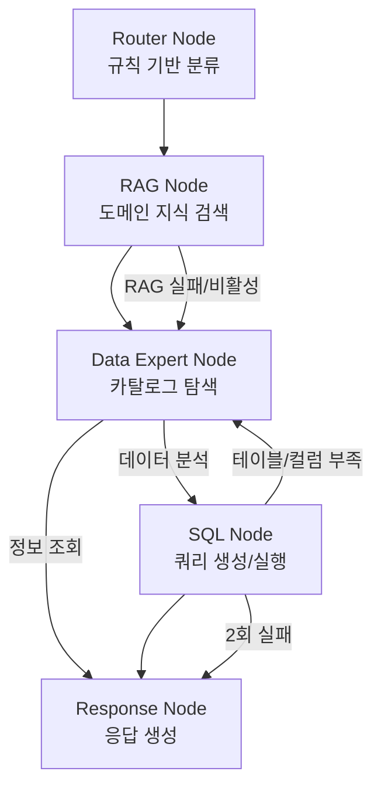

# 설계 문서: Swarm → Graph 패턴 마이그레이션

## 개요

현재 Strands Swarm 패턴(`handoff_to_agent` 기반 LLM 라우팅)을 Strands SDK의 Graph 패턴(`GraphBuilder`, 조건부 엣지 기반 결정론적 워크플로우)으로 전환합니다. 기존 에이전트(RAGAgent, DataExpertAgent, SQLAgent)의 핵심 로직은 그대로 재사용하되, 오케스트레이션 레이어만 교체합니다.

핵심 변경:
- `Swarm` → `Graph` (오케스트레이터)
- `LeadAgent` (LLM 라우터) → `RouterNode` (규칙 기반) + `ResponseNode` (LLM 응답 생성)
- `handoff_to_agent` → `GraphEdge` (조건부 엣지)

## 아키텍처

### 그래프 워크플로우



### 워크플로우 경로

1. **데이터 분석 경로**: Router → RAG → Data Expert → SQL → Response
2. **정보 조회 경로**: Router → RAG → Data Expert → Response (SQL 생략)
3. **SQL 재시도 경로**: SQL → Data Expert → SQL → Response (최대 1회 루프)
4. **RAG Fallback 경로**: Router → Data Expert (RAG 건너뜀)

### 설계 결정 사항

| 결정 | 선택 | 근거 |
|------|------|------|
| Router 구현 방식 | 규칙 기반 (키워드 매칭) | LLM 호출 없이 빠른 분류, 토큰 절약 |
| LeadAgent 대체 | RouterNode + ResponseNode 분리 | 단일 책임 원칙, 결정론적 라우팅 |
| 에이전트 재사용 | Agent 인스턴스를 GraphNode executor로 직접 사용 | Strands Graph API가 AgentBase를 노드로 지원 |
| SQL 재시도 | 조건부 엣지 + max_node_executions | Graph의 순환 그래프 지원 활용 |
| 상태 전달 | GraphState.results + invocation_state | Graph API의 기본 메커니즘 활용 |

## 컴포넌트 및 인터페이스

### 1. RouterNode (신규)

```python
# agents/multi_agent/router_node.py

from dataclasses import dataclass
from enum import Enum
from typing import Any

class RequestType(Enum):
    DATA_ANALYSIS = "data_analysis"
    INFO_QUERY = "info_query"

@dataclass
class RouterResult:
    request_type: RequestType
    user_query: str
    keywords_matched: list[str]

class RouterNode:
    """규칙 기반 요청 분류기 - LLM 호출 없음"""
    
    INFO_KEYWORDS: list[str] = [
        "테이블 목록", "스키마", "컬럼 정보", "어떤 데이터",
        "데이터베이스 목록", "테이블 구조", "메타데이터",
        "list tables", "show schema", "describe",
    ]
    
    ANALYSIS_KEYWORDS: list[str] = [
        "합계", "통계", "평균", "비교", "추이", "분석",
        "몇 개", "얼마", "가장", "최대", "최소", "비율",
        "count", "sum", "average", "total", "ratio",
    ]
    
    def classify(self, user_input: str) -> RouterResult:
        """사용자 입력을 분류하여 워크플로우 경로 결정"""
        ...
```

RouterNode는 Strands Agent가 아닌 순수 Python 클래스입니다. Graph에서는 Agent를 래핑하는 방식 대신, `invocation_state`에 분류 결과를 저장하고 조건부 엣지에서 참조합니다.

### 2. ResponseNode (신규)

```python
# agents/multi_agent/response_node.py

class ResponseNode(BaseMultiAgent):
    """최종 응답 생성 노드 - LeadAgent의 응답 통합 역할 대체"""
    
    def _setup_agent(self):
        self.agent = Agent(
            name="response_node",
            system_prompt=self.get_system_prompt(),
            model=self.model_id,
        )
    
    def get_system_prompt(self) -> str:
        """이전 노드 결과를 통합하여 사용자 친화적 응답 생성"""
        ...
```

### 3. GraphConfig (SwarmConfig 대체)

```python
# agents/multi_agent/shared_context.py 에 추가

@dataclass
class GraphConfig:
    max_node_executions: int = 15
    execution_timeout: float = 900.0   # 15분
    node_timeout: float = 300.0        # 5분
    reset_on_revisit: bool = True
    max_sql_retries: int = 2
    max_data_expert_loops: int = 1
```

### 4. MultiAgentText2SQL 변경

```python
# agents/multi_agent/multi_agent_text2sql.py

class MultiAgentText2SQL:
    """Graph 패턴 기반 멀티에이전트 오케스트레이터"""
    
    def _create_graph(self) -> Graph:
        """GraphBuilder로 워크플로우 구성"""
        builder = GraphBuilder()
        
        # 노드 추가
        router = builder.add_node(router_agent, "router")
        rag = builder.add_node(self.rag_agent.agent, "rag_node")
        data_expert = builder.add_node(self.data_expert.agent, "data_expert")
        sql = builder.add_node(self.sql_agent.agent, "sql_node")
        response = builder.add_node(self.response_node.agent, "response_node")
        
        # 엣지 구성
        builder.add_edge("router", "rag_node")
        builder.add_edge("rag_node", "data_expert")
        builder.add_edge("data_expert", "sql_node", 
                         condition=lambda state: is_data_analysis(state))
        builder.add_edge("data_expert", "response_node",
                         condition=lambda state: is_info_query(state))
        builder.add_edge("sql_node", "response_node",
                         condition=lambda state: sql_succeeded(state))
        builder.add_edge("sql_node", "data_expert",
                         condition=lambda state: needs_more_tables(state))
        builder.add_edge("sql_node", "response_node",
                         condition=lambda state: sql_max_retries(state))
        
        builder.set_entry_point("router")
        builder.set_max_node_executions(15)
        builder.set_execution_timeout(900.0)
        builder.set_node_timeout(300.0)
        builder.reset_on_revisit(True)
        
        return builder.build()
    
    def stream_response(self, user_input: str) -> Generator[Dict, None, None]:
        """기존 인터페이스 유지 - Graph 실행을 래핑"""
        ...
```

### 5. 에이전트 시스템 프롬프트 변경

기존 에이전트의 시스템 프롬프트에서 `handoff_to_agent` 관련 지시사항을 제거하고, 각 노드의 역할에 맞게 단순화합니다:

- **DataExpertAgent**: handoff 규칙 제거, MCP 도구로 카탈로그 탐색 후 결과 반환에 집중
- **SQLAgent**: handoff 규칙 제거, SQL 생성/실행 후 결과 반환에 집중  
- **RAGAgent**: handoff 규칙 제거, 검색 결과 반환에 집중

### 6. EventAdapter 업데이트

기존 `SwarmEventAdapter`를 `GraphEventAdapter`로 업데이트합니다. Graph와 Swarm은 동일한 멀티에이전트 이벤트 타입(`multiagent_node_start`, `multiagent_node_stop`, `multiagent_handoff`, `multiagent_node_stream`)을 사용하므로, 기존 변환 로직의 대부분을 재사용할 수 있습니다.

주요 변경:
- 에이전트 표시 이름 매핑에 `router`, `response_node` 추가
- 상태 메시지에 새 노드 정보 추가
- Router Node는 LLM이 아니므로 스트리밍 이벤트 없음 처리

## 데이터 모델

### 상태 전달 메커니즘

Graph에서 노드 간 데이터 전달은 두 가지 경로로 이루어집니다:

1. **GraphState.results**: 이전 노드의 실행 결과가 자동으로 후속 노드의 입력으로 전달됨
2. **invocation_state**: 모든 노드가 공유하는 딕셔너리 (MCP 클라이언트, AnalysisContext 등)

```python
invocation_state = {
    "mcp_client": self.mcp_client,
    "analysis_context": AnalysisContext(),
    "router_result": None,        # RouterNode가 설정
    "rag_results": [],             # RAG Node가 설정
    "sql_retry_count": 0,          # SQL 재시도 카운터
    "data_expert_loop_count": 0,   # Data Expert 루프 카운터
    "sql_error_type": None,        # SQL 에러 유형 (syntax/schema/table_missing)
}
```

### 조건부 엣지 함수

```python
def is_data_analysis(state: GraphState) -> bool:
    """Data Expert 이후 SQL Node로 진행할지 판단"""
    # invocation_state에서 router_result 확인
    ...

def is_info_query(state: GraphState) -> bool:
    """Data Expert 이후 Response Node로 직접 진행할지 판단"""
    ...

def sql_succeeded(state: GraphState) -> bool:
    """SQL 실행 성공 여부"""
    ...

def needs_more_tables(state: GraphState) -> bool:
    """테이블/컬럼 부족으로 Data Expert 재탐색 필요 여부"""
    ...

def sql_max_retries(state: GraphState) -> bool:
    """SQL 최대 재시도 횟수 초과 여부"""
    ...
```

### AnalysisContext 변경

기존 `AnalysisContext`는 그대로 유지하되, `invocation_state`를 통해 전달합니다. 추가 필드:

```python
@dataclass
class AnalysisContext:
    # 기존 필드 유지
    user_query: str = ""
    business_intent: Dict[str, Any] = field(default_factory=dict)
    identified_tables: List[TableInfo] = field(default_factory=list)
    generated_sql: Optional[str] = None
    query_execution_id: Optional[str] = None
    results: Optional[List[Dict]] = None
    error_messages: List[str] = field(default_factory=list)
    rag_results: List[Dict[str, Any]] = field(default_factory=list)
    rag_enabled: bool = True
    
    # 신규 필드
    request_type: str = "data_analysis"  # Router 분류 결과
    sql_retry_count: int = 0
    data_expert_loop_count: int = 0
    sql_error_type: Optional[str] = None  # "syntax", "schema", "table_missing"
```

## 정확성 속성 (Correctness Properties)

*정확성 속성은 시스템의 모든 유효한 실행에서 참이어야 하는 특성 또는 동작입니다. 속성은 사람이 읽을 수 있는 명세와 기계가 검증할 수 있는 정확성 보장 사이의 다리 역할을 합니다.*

### Property 1: Router 분류 완전성

*For any* 문자열 입력에 대해, RouterNode의 classify 메서드는 반드시 `RequestType.DATA_ANALYSIS` 또는 `RequestType.INFO_QUERY` 중 하나를 반환해야 한다.

**Validates: Requirements 1.1**

### Property 2: Router 키워드 매칭 정확성

*For any* 분석 키워드를 포함하는 문자열에 대해 RouterNode는 "데이터 분석"으로 분류하고, *for any* 정보 조회 키워드를 포함하는 문자열에 대해 RouterNode는 "정보 조회"로 분류해야 한다.

**Validates: Requirements 1.2, 1.3**

### Property 3: handoff_to_agent 제거 확인

*For any* Graph 노드로 사용되는 에이전트(DataExpertAgent, SQLAgent, RAGAgent, ResponseNode)에 대해, 해당 에이전트의 시스템 프롬프트에 "handoff_to_agent" 문자열이 포함되지 않아야 한다.

**Validates: Requirements 5.4, 9.3**

### Property 4: 이벤트 변환 형식 정확성

*For any* Graph 멀티에이전트 이벤트(node_start, node_stop, handoff, node_stream)에 대해, EventAdapter의 변환 결과는 반드시 유효한 Streamlit 이벤트 타입(`agent_status`, `agent_handoff`, `text_delta`, `tool_call`, `tool_result`, `reasoning`, `complete`, `force_stop` 중 하나)과 필수 필드를 포함해야 한다.

**Validates: Requirements 8.1, 8.2, 8.3, 8.4**

### Property 5: 노드 추적 일관성

*For any* 순서의 Graph 이벤트 시퀀스에 대해, EventAdapter의 `get_current_status()`가 반환하는 `current_agent`는 가장 최근에 시작된(node_start) 또는 전환된(handoff) 노드와 일치해야 한다.

**Validates: Requirements 8.5**

### Property 6: stream_response 이벤트 형식 호환성

*For any* stream_response가 yield하는 이벤트 딕셔너리에 대해, 해당 이벤트는 기존 형식의 키(`data`, `current_tool_use`, `tool_result`, `reasoningText`, `type` 중 하나 이상)를 포함해야 한다.

**Validates: Requirements 7.3**

## 에러 처리

### 노드별 에러 처리 전략

| 노드 | 에러 유형 | 처리 방식 |
|------|-----------|-----------|
| Router | 분류 실패 | 기본값 "데이터 분석" 반환 (Requirements 1.4) |
| RAG | OpenSearch 연결 실패 | Data Expert로 바로 진행 (Requirements 4.2) |
| RAG | RAG 비활성화 | RAG 건너뛰기 (Requirements 4.3) |
| Data Expert | MCP 도구 호출 실패 | 3회 재시도 후 Response Node로 에러 전달 |
| SQL | 구문/스키마 오류 | 자체 최대 2회 재시도 (Requirements 3.1) |
| SQL | 테이블/컬럼 부족 | Data Expert로 돌아가서 재탐색 (Requirements 3.2) |
| SQL | 2회 재시도 실패 | Response Node로 에러 전달 (Requirements 3.3) |
| Response | 응답 생성 실패 | 원본 에러 메시지를 사용자에게 직접 전달 |

### Graph 레벨 에러 처리

- `execution_timeout` (900초) 초과 시 Graph가 자동으로 실행 중단
- `node_timeout` (300초) 초과 시 해당 노드 실패 처리
- `max_node_executions` (15회) 초과 시 무한 루프 방지
- 노드 실패 시 Graph는 fail-fast 동작 (예외 전파)
- `stream_response`에서 Graph 예외를 catch하여 `force_stop` 이벤트로 변환

## 테스트 전략

### 이중 테스트 접근법

**단위 테스트 (Unit Tests)**:
- RouterNode의 분류 로직 (특정 입력에 대한 예상 출력)
- 조건부 엣지 함수 (특정 GraphState에 대한 True/False)
- EventAdapter의 이벤트 변환 (특정 이벤트에 대한 변환 결과)
- Graph 구성 검증 (노드, 엣지, 진입점 확인)
- 인터페이스 호환성 (메서드 존재 여부, 시그니처)

**속성 기반 테스트 (Property-Based Tests)**:
- 라이브러리: `hypothesis` (Python PBT 라이브러리)
- 최소 100회 반복 실행
- 각 테스트에 설계 문서의 속성 번호 태그 포함
- 태그 형식: **Feature: swarm-to-graph-migration, Property {number}: {property_text}**

**테스트 범위**:
- Property 1: 임의 문자열 → classify 결과가 유효한 RequestType
- Property 2: 키워드 포함 문자열 → 올바른 분류 결과
- Property 3: 에이전트 인스턴스 → 시스템 프롬프트에 handoff 없음
- Property 4: 임의 Graph 이벤트 → 유효한 Streamlit 이벤트 형식
- Property 5: 이벤트 시퀀스 → 노드 추적 일관성
- Property 6: stream_response 이벤트 → 기존 형식 호환

