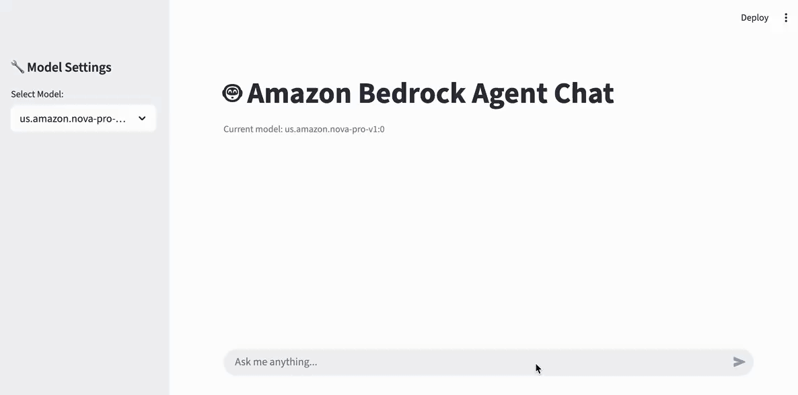

# Multi-Agent Text2SQL

A multi-agent natural-language-to-SQL application built with [Strands Agents](https://strandsagents.com/),
[Amazon Bedrock](https://aws.amazon.com/bedrock/), and a [Streamlit](https://streamlit.io/) UI.
Ask a question in plain language and a graph of specialized agents explores your
data catalog, writes SQL, runs it on [Amazon Athena](https://aws.amazon.com/athena/),
and streams the answer back with live tool-usage and reasoning views.



## Architecture

The system is orchestrated as a deterministic Strands **Graph**:

```
Router  →  RAG  →  Data Expert  →  SQL  →  Response
```

| Node | Responsibility |
|------|----------------|
| **Router** | Classifies the request and decides the workflow path |
| **RAG** *(optional)* | Retrieves schema docs / domain knowledge from OpenSearch |
| **Data Expert** | Explores the Glue Data Catalog and identifies relevant tables |
| **SQL** | Generates and executes the query on Amazon Athena |
| **Response** | Summarizes the result set into a natural-language answer |

An optional **semantic cache** node (Valkey/ElastiCache vector search) can short-circuit
repeated questions. It is disabled by default.

### Layer separation

The UI (`app/`) and the agents (`agents/`) never depend on each other directly. They
communicate through shared, event-driven infrastructure in `agents/events/`, so the agent
layer never imports UI code:

```
┌─────────────────┐    ┌────────────────────┐    ┌─────────────────┐
│   Streamlit     │    │ MultiAgentText2SQL │    │  Strands Agents │
│   Frontend      │◄──►│   (Coordinator)    │◄──►│   (Backend)     │
│   (app/)        │    │                    │    │                 │
└─────────────────┘    └────────────────────┘    └─────────────────┘
         │                        │
         ▼                        ▼
┌─────────────────┐    ┌──────────────────┐
│  Event Handlers │◄──►│  Event Registry  │
│                 │    │   (Router)       │
└─────────────────┘    └──────────────────┘
```

`MultiAgentText2SQL` (`agents/multi_agent/multi_agent_text2sql.py`) is the default
coordinator, built by the `create_multi_agent` factory in `app.py`. A simpler single-agent
`StrandsAgent` is available as the default factory in `app/config.py`.

### Event handler system

Handlers registered on the event registry run in priority order (lower runs earlier):

| Handler | Role | Priority |
|---------|------|----------|
| `StreamlitUIHandler` (`app/events/handlers.py`) | UI updates and rendering | 10 |
| `ReasoningHandler` | Reasoning process handling | 30 |
| `LifecycleHandler` | Lifecycle event management | 50 |
| `LoggingHandler` | Structured logging | 80 |
| `DebugHandler` | Debug information collection | 95 |

UI rendering is delegated to managers under `agents/events/ui/`:

| Manager | Role |
|---------|------|
| `MessageUIManager` | Message streaming and final rendering |
| `COTUIManager` | Chain-of-thought detection and filtering |
| `ToolUIManager` | Tool execution status and result display |
| `ReasoningUIManager` | Reasoning process status widgets |

The Streamlit-facing rendering helpers (`UIManager`, `MessageRenderer`,
`PlaceholderManager`, `ErrorHandler`) are consolidated in `app/ui.py`.

## Prerequisites

- An AWS account with **Amazon Bedrock model access** enabled for the models you plan to
  use (see the list in `app.py`; the default is a Claude Haiku inference profile).
- **Amazon Athena + AWS Glue Data Catalog** in your region, with at least one database of
  tables to query (see [Data setup](#data-setup)).
- An **S3 bucket** for Athena query results.
- **Python 3.12** and [uv](https://docs.astral.sh/uv/).
- AWS credentials available to the default credential chain (`aws configure`, environment
  variables, SSO, or an instance role).

## Quick start

```bash
# 1. Install dependencies
uv sync

# 2. Configure environment
cp .env.example .env
#   then edit .env — at minimum set AWS_DEFAULT_REGION and ATHENA_OUTPUT_LOCATION

# 3. Run the app
uv run streamlit run app.py
```

Open http://localhost:8501, pick a model in the sidebar, and ask a question about your
data (for example: *"How many customers are in each district?"*).

> **Note:** `ATHENA_OUTPUT_LOCATION` is required — the app fails fast on startup if it is
> not set. It must point to an S3 path in `AWS_DEFAULT_REGION`, e.g.
> `s3://your-athena-results-bucket/query-results/`.

## Data setup

The app runs Text2SQL over **whatever databases exist in your Glue Data Catalog / Athena**.
You can point it at your own tables, or reproduce the demo with the public
[BIRD benchmark](https://bird-bench.github.io/) dataset.

`scripts/setup_data.py` uploads a prepared dataset to S3 and creates a Glue crawler so the
tables become queryable in Athena:

```bash
uv run python scripts/setup_data.py \
    --source s3://ws-assets-prod-iad-r-iad-ed304a55c2ca1aee/dbc8c982-ac5b-4a1d-8ef6-7f4c24cb18b2/bird-dataset.zip \
    --target-bucket my-target-bucket \
    --region us-east-1
```

`--source` points to a prepared, public copy of the BIRD Mini-Dev dataset (~274 MB,
already converted to Parquet). Replace `my-target-bucket` with a bucket in your account.
The script will:

1. Upload the Parquet files to `s3://<target-bucket>/bird-benchmark/`
2. Create an IAM role and a Glue crawler (Glue database `ods` by default)
3. Run the crawler so the tables appear in Athena

Useful flags: `--db-filter financial,formula_1` (subset of databases), `--skip-crawler`,
`--dry-run`.

The archive contains a `bird-benchmark/<database>/<table>.parquet` layout plus a
`bird-description/` folder of markdown table descriptions (used by the optional RAG node).

> **Bring your own data:** you can point `--source` at any local or S3 zip that follows the
> same layout, or skip this script entirely and register your own tables in the Glue Data
> Catalog. The app queries whatever databases exist in Athena, regardless of how they were
> loaded. See [`bird-benchmark/README.md`](bird-benchmark/README.md) for BIRD dataset
> download links.

## Optional features

### RAG (schema-aware retrieval)

Set `OPENSEARCH_ENDPOINT` (and `OPENSEARCH_INDEX`) in `.env` to enable the RAG node, which
retrieves schema/domain docs to improve SQL accuracy. Index your descriptions first:

```bash
uv run python scripts/index_opensearch.py --help
```

If `OPENSEARCH_ENDPOINT` is unset, the app runs without RAG.

### Semantic cache (Valkey)

The cache node is disabled by default. To experiment with it, start a local Valkey and
uncomment the cache wiring in `agents/multi_agent/multi_agent_text2sql.py`:

```bash
docker run -p 6379:6379 valkey/valkey
```

`VALKEY_ENDPOINT` / `VALKEY_PORT` default to `localhost:6379`.

## Project structure

```
multi-agent-text2sql/
├── app.py                          # Streamlit entry point (builds AppConfig, runs the app)
├── app/                            # Streamlit UI layer
│   ├── main.py                     # StreamlitChatApp
│   ├── config.py                   # AppConfig (models, agent factory, validation)
│   ├── env_loader.py               # .env loading
│   ├── session.py                  # SessionManager (Streamlit session state)
│   ├── chat.py                     # ChatHandler (streaming loop)
│   ├── ui.py                       # UIManager, MessageRenderer, PlaceholderManager, ErrorHandler
│   ├── ui_manager.py               # legacy UIManager (superseded by ui.py)
│   └── events/handlers.py          # StreamlitUIHandler
├── agents/
│   ├── strands_agent.py            # Single-agent StrandsAgent (default factory)
│   ├── my_custom_agent.py          # Earlier single-agent implementation
│   ├── multi_agent/                # Multi-agent graph
│   │   ├── multi_agent_text2sql.py # Coordinator: builds Router→RAG→DataExpert→SQL→Response
│   │   ├── router_node.py  sql_agent.py  data_expert_agent.py
│   │   ├── rag_agent.py  vector_search.py          # RAG (OpenSearch), optional
│   │   ├── cache_node.py  semantic_cache.py        # semantic cache (Valkey), optional
│   │   ├── response_node.py  graph_conditions.py  shared_context.py
│   │   ├── base_agent.py  constants.py  event_adapter.py
│   └── events/                     # Shared event infrastructure (UI-agnostic)
│       ├── registry.py  lifecycle.py
│       └── ui/                     # cot, messages, reasoning, tools, state, utils, placeholders
├── scripts/
│   ├── setup_data.py               # Upload BIRD parquet to S3 + create Glue crawler
│   ├── index_opensearch.py         # Index schema descriptions into OpenSearch (RAG)
│   ├── evaluate.py                 # BIRD benchmark evaluation
│   └── clear_cache.py              # Clear the semantic cache
├── bird-benchmark/                 # Dataset download notes + markdown table descriptions
├── eval_prompts/  eval_samples/    # Evaluation prompts and sample question sets
├── tests/                          # Unit / integration tests
├── .kiro/                          # Spec-driven-development artifacts (specs & steering)
├── pyproject.toml  uv.lock  .python-version
└── .env.example
```

## Tests

```bash
uv run pytest tests -v
```

## Notes

- Running this sample uses billable AWS services (Bedrock, Athena, S3, and optionally
  OpenSearch/ElastiCache). Review the relevant pricing pages before running at scale.
- This sample is provided for reference. Perform a security review before any production use.
- **No guardrails are configured in this sample.** For production use, add
  [Amazon Bedrock Guardrails](https://aws.amazon.com/bedrock/guardrails/) — for example,
  PII detection/redaction, denied topics, and content filters — especially when the
  underlying data source may contain PII or other sensitive information.

## License

MIT-0. See the repository [LICENSE](../../LICENSE).
