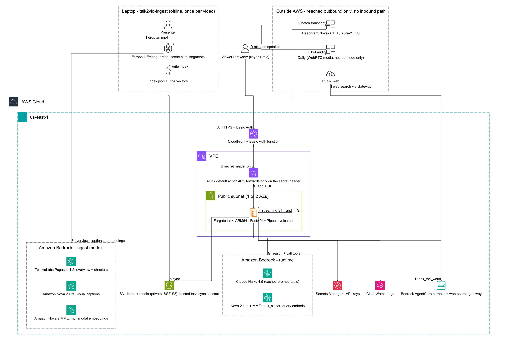

# Architecture — Talk to your Video

How a spoken question about a pre-recorded video becomes a grounded spoken answer,
and why the system is shaped this way.

Every model runs on Amazon Bedrock. Storage is one private S3 bucket. In local mode
nothing is publicly exposed at all; the optional hosted path adds CloudFront, an ALB
and a single Fargate task.

---

## Contents

- [The whole system on one page](#the-whole-system-on-one-page)
- [Ingest — offline, once per video](#ingest--offline-once-per-video)
- [Runtime — per session, per question](#runtime--per-session-per-question)
- [The three tools](#the-three-tools)
- [Model choices](#model-choices)
- [Why this shape](#why-this-shape)
- [Latency](#latency)
- [Local mode vs hosted mode](#local-mode-vs-hosted-mode)
- [Security posture](#security-posture)
- [Cost](#cost)
- [Code layout](#code-layout)
- [Deliberately not built](#deliberately-not-built)

---

## The whole system on one page

Ingest steps are numbered **1–5**, the live conversation path is lettered **A–I**.



Two detail diagrams cover each half on its own:

| Diagram | Scope |
|---|---|
| [architecture-ingest.png](architecture-ingest.png) | The offline pipeline, one video at a time |
| [architecture-runtime.png](architecture-runtime.png) | The hosted request and media paths |

All three are generated from checked-in
[diagram-as-code](https://github.com/awslabs/diagram-as-code) sources, so they are
edited as text and re-rendered:

```bash
awsdac -f docs/architecture.yaml         -o docs/architecture.png
awsdac -f docs/architecture-ingest.yaml  -o docs/architecture-ingest.png
awsdac -f docs/architecture-runtime.yaml -o docs/architecture-runtime.png
```

The same thing as one logical flow, which is closer to how a question is actually
answered:

```
                                   ┌─ ingest (once per video, offline) ──────────────────────────┐
  videos/clip.mp4 ────────────────▶│ ffprobe scene detection → coherent segments                 │
                                   │ Deepgram Nova-3        → word-level transcript + speakers   │
                                   │ TwelveLabs Pegasus 1.2 → whole-video summary + chapters     │
                                   │ Amazon Nova 2 Lite     → dense visual caption per segment   │
                                   │ Nova 2 Multimodal Embeddings (async, audio+visual fused)    │
                                   └──────────────┬──────────────────────────────────────────────┘
                                                  ▼
                                   data/index/<id>.json  +  <id>.vectors.npz    (durable copy in private S3)
                                                  │
  ┌─ runtime (per question) ───────────────────────┼─────────────────────────────────────────────┐
  │  mic ──WebRTC──▶ Deepgram Nova-3 (streaming STT)                                            │
  │                       │                                                                     │
  │                  playhead tagger ── prefixes "[watching 2:15]"                               │
  │                       │                                                                     │
  │                  Silero VAD + smart turn detection (barge-in)                                │
  │                       │                                                                     │
  │                  Claude Haiku 4.5 on Bedrock ◀──▶ find_moment · look_closer · ask_the_world   │
  │                       │            (whole video timeline already in the cached prompt)        │
  │                  Deepgram Aura-2 (streaming TTS)                                              │
  │                       │                                                                     │
  │  speaker ◀──WebRTC────┘        RTVI data channel ──▶ transcript, timeline cues, seeks         │
  └─────────────────────────────────────────────────────────────────────────────────────────────┘

  ask_the_world ─▶ AgentCore Harness (managed agent loop, isolated env, session memory)
                        │  Claude Haiku 4.5
                        ▼
                   AgentCore Gateway (MCP, AWS_IAM) ─▶ Web Search connector
                                                        Amazon's own web index;
                                                        queries never leave AWS
```

---

## Ingest — offline, once per video

`talk2vid/ingest.py`, run as `uv run talk2vid-ingest videos/<file>.mp4`. Roughly
1.5–3 minutes for a 10-minute video, most of it the async embedding job.

| Step | What happens | Where |
|---|---|---|
| **1** | `ffprobe` probes the file; scene-change scores are ranked and cut into coherent segments of ~6–20s (target 12s) | `media.py` |
| **2** | Deepgram Nova-3 returns a word-level transcript with speaker labels | `transcribe.py` |
| **3a** | The mp4 is uploaded to the private bucket — Bedrock's video models read from S3, not from the wire | `ingest.py:upload_video` |
| **3b** | TwelveLabs Pegasus 1.2 watches the whole video and returns a summary plus structured JSON chapters (falls back to Nova 2 Lite) | `bedrock.py` |
| **3c** | Amazon Nova 2 Lite writes a dense visual caption per segment, 8 at a time | `bedrock.py` |
| **3d** | Nova 2 Multimodal Embeddings runs an async segmented job over the video, fusing audio and visual into one vector per ~15s | `bedrock.py` |
| **4** | Everything is written to `data/index/<id>.json`, vectors to `<id>.vectors.npz` | `index_store.py:save` |
| **5** | Both are synced to the bucket, so the hosted task can pull them at start | `index_store.py:push_to_s3` |

**Every enrichment step degrades gracefully.** Without Pegasus, captions or
embeddings you still get a talkable video from the transcript and timeline alone.
Re-running with `--skip-captions` / `--skip-embeddings` / `--skip-overview` reuses
the existing index for the skipped parts instead of discarding them.

Scenarios (`cloud`, `healthcare`, `sports`, `education`, `tech`, `general`) set the
agent's domain guidance, the card colour and the suggested questions — see
`SCENARIOS` in `talk2vid/config.py`. The healthcare persona is deliberately
conservative: report only what was said, never add medical advice.

### What the index holds

`VideoIndex` (`index_store.py`) is the single runtime data structure:

- **`meta`** — title, duration, scenario, the Pegasus overview and chapters.
- **`segments`** — per segment: `start`, `end`, the `speech` in that window, and the
  `visual` caption. This is what becomes the prompt's timeline.
- **`vectors`** — an `(n, 1024)` float array, one row per segment, or `None`.

Two derived views matter:

- `knowledge_pack(max_chars=48000)` renders the whole index as the text block that
  goes into the system prompt.
- `search(query, query_vec, top_k)` is the hybrid retrieval used by `find_moment`:
  scaled cosine similarity over `vectors`, scaled lexical scoring over `speech` and
  `visual` text, plus a phrase bonus for exact matches. With no vectors it degrades
  to lexical only.

---

## Runtime — per session, per question

`talk2vid/bot.py` builds one Pipecat pipeline per session; `talk2vid/server.py` is
the FastAPI app that serves the UI, the video bytes and the signalling.

| Step | What happens |
|---|---|
| **A** | The browser loads the app. Hosted: CloudFront enforces Basic Auth at the edge. Local: `127.0.0.1:7860`, no gate |
| **B** | CloudFront forwards to the ALB with a secret header; the ALB's default action is `403` |
| **C** | The Fargate task serves the UI, `/api/videos`, the timeline and the mp4 (with Range support, so the player can seek) |
| **D** | Voice media: peer-to-peer SmallWebRTC to the laptop locally, or a private per-session Daily room when hosted |
| **E** | The bot's synthesised audio goes back over the same transport |
| **F** | Deepgram Nova-3 streams STT in; Aura-2 streams TTS out (`utterance_end_ms` must be ≥ 1000 or the socket is rejected) |
| **G** | Claude Haiku 4.5 on Bedrock reasons over the cached prompt and calls tools. `look_closer` adds a Nova 2 Lite vision call; `find_moment` adds a Nova 2 MME query embedding |
| **H** | `ask_the_world` invokes the AgentCore harness |
| **I** | The harness reaches Amazon's web index through an AgentCore Gateway over MCP |

Two custom Pipecat processors carry the demo's two least obvious behaviours:

- **`PlayheadTagger`** prefixes every user transcription with `[watching 2:15]`
  before the model sees it. That is why "this bit", "here" and "right now" resolve
  to wherever the viewer actually is.
- **`TurnSpeechFlag`** tracks whether the model already narrated its own holding
  phrase in the same reply that called a tool. If it did, the tool stays quiet; if
  it did not, the tool speaks a fallback phrase. Never dead air, never a duplicated
  sentence.

### Playback ownership

The rule the demo is built around: **the viewer starts playback, nothing else ever
does.** Opening the mic does not start it. A tool-driven jump moves the playhead
*without* changing play/pause, so a paused frame stays paused and stays on screen
while it is being discussed.

The one thing the app does on its own is **pause**: opening the mic, speaking (VAD),
typing a question, or the bot beginning to speak all call `holdVideo()` in
`client/app.js`, so the agent never talks over the clip. Pressing play again is
always the viewer's call.

### Browser client

`client/` speaks Pipecat's SmallWebRTC signalling and the RTVI protocol directly —
no SDK, no bundler, no CDN. RTVI's data channel carries the transcript, tool status,
timeline cues and seek commands alongside the audio. The Daily driver is a second,
lazily imported path behind the same three methods, so the local demo loads nothing
extra. That driver dynamically imports `client/vendor/daily-esm.js`, which is not in
the repository — `npm install` copies it out of `@daily-co/daily-js` (see the
`vendor` script in `package.json`). Local mode never touches it; hosted mode needs
it present before `scripts/deploy.py` builds the image, since the build archive is
taken from the working tree. Static files are served `no-store`, because a stale cached `app.js` is a
miserable thing to debug live.

---

## The three tools

Defined in `talk2vid/tools.py`; the model gets these and nothing else.

### `find_moment(query, seek=False)`

Hybrid search over the index, returns the top segments with timecodes. When `seek`
is set, the client moves the playhead there and draws markers on the timeline. Query
embeddings are LRU-cached, so a rehearsed question costs nothing the second time,
and if the embedding call exceeds its 1.2s budget the tool falls back to lexical
ranking rather than leaving dead air.

### `look_closer(question, at_time=None)`

Extracts the actual frames at the playhead (or at `at_time`) with ffmpeg and sends
them to Nova 2 Lite. This is what answers "what's written on the screen right now?"
— the ingest-time caption is a summary, and sometimes the question is about a detail
no summary would keep.

### `ask_the_world(question, filler=None)`

Hands off to an Amazon Bedrock AgentCore harness. Returns prose, which the voice
agent reads out.

**Why a second agent rather than a search tool.** The voice agent must stay small
and fast — its whole job is the video. Anything outside it goes to the harness: a
managed agent loop in its own isolated environment, with its own session state,
reaching Amazon's web index through an AgentCore Gateway over MCP. The voice agent
asks a question and gets prose back; it never sees search results, never parses
them, and never grows a second personality. Swapping the harness's model or adding
tools to it (code interpreter, browser, private APIs behind the same gateway)
changes nothing in the voice pipeline.

There is **no third-party search API** anywhere in this project, and so no search
key to rotate.

---

## Model choices

| Job | Model | Why not the other option |
|---|---|---|
| Conversation + tools | `us.anthropic.claude-haiku-4-5` | Best instruction-following for terse spoken answers. Nova Lite is ~250ms faster to first token — see the fast profile below |
| Query & segment embeddings | `amazon.nova-2-multimodal-embeddings-v1:0` | One embedding space for video, audio and text, and it has a **synchronous** path (~0.4s warm) for the query side. TwelveLabs Marengo is async-only on Bedrock, which costs seconds mid-conversation |
| Whole-video understanding | `twelvelabs.pegasus-1-2` | Video-native, and it returns structured JSON chapters in one pass. Falls back to Nova 2 Lite automatically |
| Frame-level visual reasoning | `us.amazon.nova-2-lite` | Fast and cheap enough to caption every segment at ingest and still serve `look_closer` live |
| Speech in / out | Deepgram Nova-3 / Aura-2 | Streaming both ways, ~0.3s TTS time-to-first-byte |
| Outside-world knowledge | AgentCore harness + Web Search | No third-party search API, no keys to rotate, and queries are served inside AWS instead of being sent to an external engine |

Every ID is env-overridable (`TALK2VID_LLM_MODEL_ID`, `TALK2VID_VISION_MODEL_ID`,
`TALK2VID_PEGASUS_MODEL_ID`, `TALK2VID_EMBED_MODEL_ID`) so the demo can be
re-pointed without code edits.

---

## Why this shape

**The whole video goes in the prompt, not a vector store.** A 5–10 minute clip's
indexed timeline (transcript + visual captions + chapters) is only a few thousand
tokens. Putting it all in the system prompt and letting Bedrock prompt caching hold
it means the common case — "what did they say about X?" — needs *zero* retrieval
calls. Retrieval is reserved for what it is actually good at: finding a specific
moment to jump to.

**Prompt caching pays off on real videos, not on short ones.** A 7½-minute interview
clip's knowledge pack is 7,600 tokens: the first turn writes it to cache, and every
turn after reads it, halving time-to-first-token from 1.56s to 0.77s. A 45-second
clip sits under Claude's ~2,048-token cache minimum, where the markers are ignored
and add latency instead — so caching is enabled per session only for Anthropic
models above a size that actually benefits (`bot.should_cache_prompt`).

**Cold connections cost ~700ms.** The first Bedrock call on a fresh TLS connection
takes 1.4s versus 0.7s warm, so the server and each new session warm the LLM and
embedding endpoints in the background before anyone speaks (`bedrock.warmup`,
called from the FastAPI lifespan).

**Filling the wait.** Six to ten seconds is a long silence in a conversation, so the
agent says something first — see `TurnSpeechFlag` above.

**An in-memory matmul beats a vector database here.** One video per session, ~50
segments: the network round-trip to a managed store costs more than the search.

---

## Latency

Voice-to-voice, end of speech to first audio back, on a warm local run:

| Turn type | Latency | Where it goes |
|---|---|---|
| Answered from context | **~2.1–2.3s** | STT final ~0.6s · LLM first token ~0.7s · TTS ~0.35s · turn detection ~0.5s |
| With `find_moment` | **~3.9s** | adds a query embedding (~0.4s) and a second LLM pass |
| With `look_closer` | **~5.0s** | adds frame extraction (~0.1s) and a vision call (~1.5s) |
| With `ask_the_world` | **~6–10s** | the harness runs a full agent loop; the agent narrates a holding phrase first so the pause is filled |

The harness's *first* call after it is created takes ~40s while its environment is
provisioned. `scripts/preflight.py` makes that call for you, so the demo never pays
it.

**Fast profile** — trade some answer quality for ~250ms:

```bash
TALK2VID_LLM_MODEL_ID=us.amazon.nova-lite-v1:0 uv run talk2vid
```

For a genuinely sub-second experience you would need a speech-to-speech model
(`amazon.nova-2-sonic-v1:0`, which Pipecat supports) — but that replaces the
Deepgram STT/TTS stages and the cascaded pipeline this demo is built to show.

---

## Local mode vs hosted mode

`TALK2VID_TRANSPORT` picks the media path. Everything else is identical.

| | Local (`webrtc`, default) | Hosted (`daily`) |
|---|---|---|
| Public surface | none; binds `127.0.0.1` | CloudFront URL + Basic Auth |
| Media | peer-to-peer SmallWebRTC, browser ↔ laptop | private per-session Daily room |
| Compute | the laptop | one ARM64 Fargate task, 1 vCPU / 2 GB |
| Assets | `data/index/` and `videos/` on disk | synced from S3 at container start |
| Signalling | `POST /api/offer` | `POST /api/connect` |
| Why | lowest latency; the rehearsal and stage path | a URL to share with a second presenter or a remote room |

Voice media never touches the CloudFront/ALB stack. Hosted mode exists because
there is no inbound UDP path through an ALB — the bot joins a Daily room instead, so
there is no TURN server to run and no port to open.

`scripts/deploy.py` builds the container **inside AWS** (CodeBuild on ARM, no local
Docker daemon), pushes it to a private ECR repo, and creates the `talk2vid` stack
from `deploy/app.yaml`. Assets are not baked into the image, so re-ingesting a video
needs no rebuild — just restart the service.

Two template defects worth remembering, both found the hard way: a security group's
`GroupDescription` must be pure ASCII, and AgentCore `InvokeHarness` is authorized
by the `bedrock-agentcore:InvokeAgentRuntime` IAM action, not by one of its own
name.

---

## Security posture

- **No public surface in local mode.** The server binds to `127.0.0.1`. The browser
  and the bot are WebRTC peers on the same machine; AWS is reached outbound only.
- **The hosted path is closed by default.** CloudFront enforces Basic Auth at the
  edge before a request reaches the origin. The ALB's listener answers `403` to
  everything and only forwards requests carrying CloudFront's secret header, and its
  security group admits only CloudFront's managed prefix list — so the ALB's own DNS
  name is a dead end. The task's security group allows no inbound internet at all
  (only the ALB on 7860) and outbound 443 only. Keys are injected from Secrets
  Manager, never baked into the image or the task definition.
- **No third-party data egress for search.** Web search runs through AgentCore
  Gateway against Amazon's own index, so questions are served inside AWS rather than
  handed to an external provider. There is no search API key anywhere in the project.
- **Scoped IAM.** Two purpose-built roles: the gateway role may only invoke the
  gateway and the web-search connector ARN; the harness role adds model access and
  its own session memory. Neither can touch anything else.
- **The S3 bucket is private and audited.** All four Block Public Access switches on,
  ACLs disabled (`BucketOwnerEnforced`), SSE-S3 default encryption, a bucket policy
  that denies non-TLS and TLS < 1.2, and lifecycle expiry on media and embedding
  artifacts. `provision_aws.py --verify` asserts all of it and fails loudly;
  `preflight.py` re-checks it before a demo.
- **No Lambda, no API Gateway, no public S3, no wildcard-open security group** — and
  in local mode, no CloudFront or load balancer either; `deploy.py` is opt-in.
- Video files are served from the app's own disk, never from a public bucket. S3 is
  the handoff location Bedrock's video models read from, and the sync source for the
  hosted task.
- Secrets live in `.env`, which is gitignored. **One third-party key remains
  (Deepgram) and it is in plaintext there — rotate it after the talk.**
- Never open the microphone in an automated browser test. Stub or deny
  `getUserMedia` so the client takes its text-only path; a Playwright run on a
  profile with standing mic permission once captured a minute of live meeting audio.

---

## Cost

Ingest for a 10-minute clip is a few tens of cents: one Pegasus pass, ~50 Nova 2
Lite captioning calls, one async embedding job, and Deepgram transcription.

Runtime is a small Haiku 4.5 call per turn plus Deepgram streaming minutes. The
AgentCore gateway and each web search are billable, and the harness is billed only
while it runs — `scripts/provision_agentcore.py --teardown` removes it when the demo
is over.

Hosted: one 1 vCPU / 2 GB ARM Fargate task plus the ALB is roughly $0.05/hour.
`deploy.py --park` sets desired count to 0 between rehearsals, leaving only the ALB
and CloudFront. S3 lifecycle rules expire media and embedding artifacts so nothing
accumulates.

---

## Code layout

```
talk2vid/
  config.py        models, paths, scenarios — all env-overridable
  ingest.py        the offline pipeline (CLI: talk2vid-ingest)
  bedrock.py       every Bedrock call, plus connection warmup
  transcribe.py    Deepgram pre-recorded transcription
  media.py         ffmpeg: probing, scene detection, segmentation, keyframes
  index_store.py   index persistence + hybrid retrieval
  prompt.py        system prompt / knowledge pack construction
  tools.py         find_moment · look_closer · ask_the_world
  agentcore.py     AgentCore harness client (outside-world knowledge)
  bot.py           the Pipecat pipeline (CLI: talk2vid), local + Daily transports
  rooms.py         private, expiring Daily rooms for the hosted path
  sync_assets.py   pulls indexes and media from S3 at container start
  server.py        FastAPI: UI, media, WebRTC signalling, /api/connect
client/            browser client (RTVI over the data channel; Daily SDK vendored)
scripts/           provision_aws · provision_agentcore · preflight · voice_probe · deploy
deploy/            Dockerfile · buildspec.yml · app.yaml (CloudFormation)
docs/              architecture diagrams (PNG + diagram-as-code source) + this document
```

---

## Deliberately not built

- **Autoscaling / multi-tenancy.** One Fargate task, and a session's state lives in
  its memory. Fine for a demo with a handful of viewers; a real deployment would
  move session state out and scale on connection count.
- **A custom domain and real auth.** CloudFront's default certificate and a shared
  password are right for a stage demo. Cognito or an OIDC provider in front of the
  distribution is the production answer.
- **A managed vector store.** With one video per session and ~50 segments, an
  in-memory matmul is faster than any network call. S3 Vectors or OpenSearch is the
  right answer at library scale — swap `index_store.search`.
- **Speech-to-speech.** Nova 2 Sonic would be faster, but the cascaded
  STT → LLM → TTS pipeline is part of what this demo exists to show.
